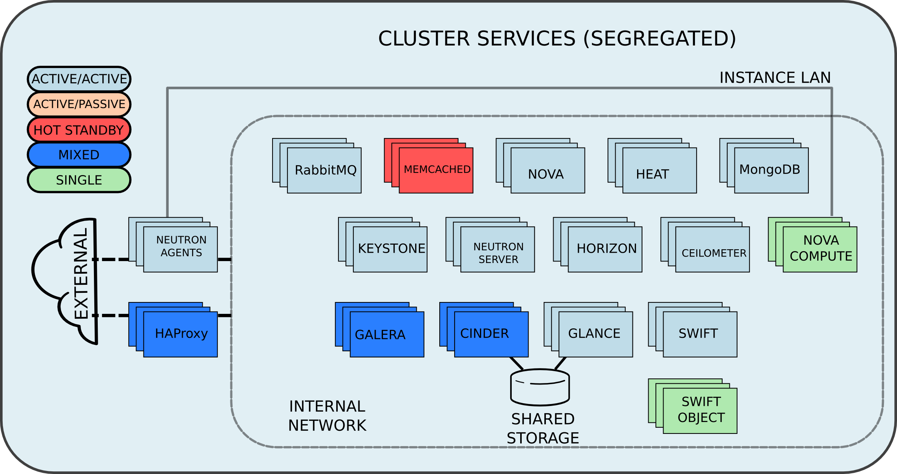

= Running EAP 6 on RHEL OSP 7
Jacob Liberman <jliberma@redhat.com>
v1.0, 2015-08-05
:description: Reference architecture
:doctype: book
:title-logo-image: image:images/rh-ra-banner.jpg[scaledwidth=70%,align=center]
// Settings:
:compat-mode:
:experimental:
:listing-caption: Listing
:icons: font
:toc:
:toclevels: 3
ifdef::backend-pdf[]
:pagenums:
:pygments-style: bw
:source-highlighter: pygments
endif::[]

[abstract]
//empty on purpose so that legal can be on separate page and not conflict with toc

<<<
 
100 East Davie Street + 
Raleigh NC 27601 USA + 
Phone: +1 919 754 3700 + 
Phone: 888 733 4281 + 
Fax: +1 919 754 3701 + 
PO Box 13588 + 
Research Triangle Park NC 27709 USA + 

Linux is a registered trademark of Linus Torvalds. Red Hat, Red Hat Enterprise Linux and the Red Hat "Shadowman" logo are registered trademarks of Red Hat, Inc. in the United States and other countries.
Microsoft and Windows are U.S. registered trademarks of Microsoft Corporation.
UNIX is a registered trademark of The Open Group.
Intel, the Intel logo and Xeon are registered trademarks of Intel Corporation or its subsidiaries in the United States and other countries.
All other trademarks referenced herein are the property of their respective owners.

© 2015 by Red Hat, Inc. This material may be distributed only subject to the terms and conditions set forth in the Open Publication License, V1.0 or later (the latest version is presently available at http://www.opencontent.org/openpub/).

The information contained herein is subject to change without notice. Red Hat, Inc. shall not be liable for technical or editorial errors or omissions contained herein.

Distribution of modified versions of this document is prohibited without the explicit permission of Red Hat Inc.

Distribution of this work or derivative of this work in any standard (paper) book form for commercial purposes is prohibited unless prior permission is obtained from Red Hat Inc.

The GPG fingerprint of the security@redhat.com key is:
CA 20 86 86 2B D6 9D FC 65 F6 EC C4 21 91 80 CD DB 42 A6 0E

Send feedback to refarch-feedback@redhat.com

<<<

== Comments and Feedback

In the spirit of open source, we invite anyone to provide feedback and comments on any reference architectures. Although we review our papers internally, sometimes issues or typographical errors are encountered. Feedback allows us to not only improve the quality of the papers we produce, but allows the reader to provide their thoughts on potential improvements and topic expansion to the papers.
Feedback on the papers can be provided by emailing refarch-feedback@redhat.com. Please refer to the title within the email.

=== Staying In Touch

Join us on some of the popular social media sites where we keep our audience informed on new reference architectures as well as offer related information on things we find interesting.

==== Like us on Facebook:
https://www.facebook.com/rhrefarch

==== Follow us on Twitter:
https://twitter.com/RedHatRefArch

==== Plus us on Google+
https://plus.google.com/u/0/b/114152126783830728030/

[abstract]
== Executive Summary
Red Hat Enterprise Linux OpenStack Platform (RHEL OSP) 7 is a reliable cloud infrastructure platform based on OpenStack. RHEL OSP 7 has a modular, service-based architecture designed for massive scalability. 
This document describes Red Hat's approach to scaling OpenStack. 
Core OpenStack services are managed and monitored in highly available clusters. A  load balancer provides access to the service endpoints. There are no direct connections from the clients to the services.

Benefits of this approach include:

* Highly available state database and messaging queues
* Services can be scaled by adding controller nodes
* Service isolation simplifies troubleshooting
* Granular startup control satisfies service interdependencies

It also introduces OSP-d: a tool for deploying and managing OpenStack Platform. OSP-d combines features from various open source projects including OpenStack TripleO, RDO Manager, and Spinal Stack.   

This reference architecture describes a realistic use case for deploying a multi-tier EAP application on a highly available OSP 7 cluster.  
The first section of this reference architecture introduces the principal components: OSP 7, OSP-d, and EAP.  The second section describes the lab environment, hardware, and software versions used to test the reference architecture. The third section lists the steps performed by the Red Hat Systems Engineering team to deploy the reference architecture in their lab using the OSP director, production code, and bare metal servers.

== Architecture Overview

=== Red Hat Enterprise Linux  OpenStack Platform 7
Red Hat Enterprise Linux OpenStack Platform delivers an integrated foundation to create, deploy, and scale a secure and reliable public or private OpenStack cloud. Red Hat Enterprise Linux OpenStack Platform combines the world’s leading enterprise Linux and the fastest-growing cloud infrastructure into a single platform that can scale quickly without compromising on availability, security, or performance.

=== Red Hat JBOSS Enterprise Application Platform
Red Hat® JBoss® Enterprise Application Platform (EAP) is a fully certified Java™ EE platform for developing and deploying enterprise applications. 

=== OpenStack Platform director

Red Hat Entperprise Linux OpenStack Platform 7 (RHEL OSP) is based on
the Kilo OpenStack release. Red Hat's latest release includes many 
enhancements and updates to the previous versions including full support for
Ironic -- the OpenStack baremetal provisioning service. RHEL OSP 7
also introduces OpenStack Platform director, a cloud installation and
lifecycle management utility. OpenStack Platform director is the first 
Red Hat OpenStack Platform installer to deploy OpenStack on and with 
OpenStack. 

This section of the paper introduces the OSP director architecture and
important terminology. 

==== OpenStack Platform director Terminology and Architecture
OSP director is a converged installer. It combines mature upstream
OpenStack deployment projects (TripleO and Ironic) with
principal components from Red Hat's past OpenStack Platform
installers.

TripleO stands for "OpenStack on OpenStack." TripleO is a upstream
OpenStack project that uses an existing deployment OpenStack
environment to install a production OpenStack environment. The
deployment environment is called the undercloud. The production
environment is called the overcloud. 

The undercloud uses native OpenStack APIs and services to deploy,
configure, and manage the production OpenStack deployment. For this
reason the undercloud is also referred to as the control plane. 

The undercloud uses Heat templates to define the overcloud and the Ironic
baremetal provisioning service to deliver it. OSP director includes Heat 
templates for the basic server roles that comprise the overcloud. Heat 
templates allow OSP director to install and scale overcloud
servers in a repeatable fashion. They can also be customized and
re-used. 

OSP director uses Ironic to deploy the overcloud servers. OpenStack
Ironic is an upstream bare-metal provisioning project that is fully 
supported with the Kilo release. Ironic is responsible for the power
management of the nodes as well as gathering hardware information
about them via a discovery mechanism known as introspection. Ironic
pairs discovered nodes with bootable disk images.

The disk images contain all OpenStack services. OSP director injects
OpenStack Puppet modules into the image during installation to provide
a facility for post-installation configuration. By default the
OpenStack image contains all services. OSP director uses Puppet 
to selectively enable or disable OpenStack services for each node based on
pre-defined roles. Heat also used Puppet manifests and parameters to
further customize nodes post-deployment. Typical customizations
include network and storage configuration. 

Once the overcloud is deployed it runs independently from the
undercloud. The overcloud is comprised of one or more servers in the
following roles:

[glossary]
*Control*::
    provides the endpoint for REST-based API queries to the majority of the OpenStack services. These include Compute, Image, Identity, Block, Network, and Data processing. Although RHEL OSP allows for multiple, high availability cloud controllers, only one cloud controller is used in this reference architecture. 
*Compute*::
    Compute node refers to an OpenStack server that runs a KVM hypervisor. It is responsible for running virtual machine instances. In this reference architecture, Hadoop clusters are instantiated across multiple compute nodes. By default a new instance is spawned on the compute node with the most free memory in a round robin fashion.
*Swift Storage*::
    Understanding the Swift ring is central to understanding the role of a server in the Swift cluster. A Swift ring represents a mapping between the names of entities stored on disk and their physical location. There are separate rings for accounts, containers, and objects. When a component needs to interact with an object, container, or account, it interacts with the appropriate ring to determine the target’s location in the cluster. 
*Block Storage*::
    definition
*Ceph Storage*::
    definition

Finally, OSP director also includes hardware validation and profile
matching tools from the eNovance SpinalStack installer. Advanced
profile matching allows adinistrators to specify hardware
requirements for server roles. Only servers that meet the requirements
will be eligble to perform the specified role. Profile to role
matching is performed after introspection but prior to deployment. 

OSP director also supports role matching based on benchmark performance
data that is gathered prior to installation by booting the servers to
a customized RAMdisk and recording the results of extensive benchmark
testing. The benchmark feature is not only useful for role matching
but also for outlier detection. Underperforming nodes can be
identified and corrected prior to deployment.

=== OSP director features

====  Network Isolation
Sensible network design is critical for cloud security, scalability,
and performance. This introduces network terminology used throughout
the paper as well as network design decisions at every level of the
deployment. 

===== Network roles
A typical OpenStack deployment requires multiple network functions.
While it is possible to collapse all network functions onto a single
network interface, it is better to isolate various types of
communication in their own physical or virtual networks. OSP director
supports network isolation by segmenting traffic into logical types.
One or more traffic types can be flexibily assigned to a physical,
virtual, or bonded interface. Multiple traffic types can be combined  
across the same physical interfaces or switches. 

OSP director collapses all network traffic types onto a single network
by default. While this network configuration is suitable for
evaluation, proof of concept, and development environments, it is not
suitable for scalable or production environments. Therefore, this
reference architeture utilizes the OSP director network isolation feature
to segment network traffic by type. 

. *Provisioning* -- All cluster nodes must have access to the
  provisioning network. As the name implies, the control plane
  installs the overcloud via the provisioning network. This network
  should be on a native VLAN because it must carry PXE traffic.
  Ideally the provisioning network has a dedicated physical interface.
  Post-deployment the provisioning interface is primarily used as a
  default gateway for the overcloud nodes if another gateway port does
  not exist on the network.
. *External* -- This network provides overcloud nodes with external
  connectivity. Controller nodes will map the external network to an
  Open vSwitch bridge and forward traffic originating from hypervisor
  instances through it. 
. *Internal API* -- This network exposes the OpenStack APIs endpoints to
  the overcloud nodes. It handles inter-service communication between 
  core OpenStack services as well as the supporting services.
. *Tenant* -- Virtual machines communicate over the tenant network. The
  tenant network supports three modes of operation: VXLAN, GRE, and
  VLAN. By default OSP director uses VXLAN tunnels to extend layer 2
  communication in the same tenant across hypervisors. (?? maybe
  separate to another section.)
. *Storage* -- This network carries storage traffic. This includes Ceph,
  Cinder, and Swift traffic types. Data-internsive OpenStack
  deployments should isolate Storage traffic on a high bandwidth
  interface.
. *Storage Management* -- The communication overhead inherent to large
  scale distributed storage systems can generate large amounts of
  network traffic. For that reason it is often best to isolate storage
  management traffic from Storage traffic.

OSP director offers flexibility in determining which traffic
to isolate and where. Section ?? discusses how network traffic
types were mapped to physical network resources in this reference
architecture.

===== Required network types by server role
Server roles were discussed in section ??. Different server roles
require access to different network traffic types. The requirements
are summarized in the following table:

?? table mapping network types to roles

===== Tenant network types
OpenStack Platform supports several tenant network communication
types through the OpenStack Networking (Neutron) service. OSP director
does not deploy Nova networking by default. OpenStack Neutron supports
overlapping IP address ranges across tenants via the Linux kernel's
network namespace capability. It also supports three default
networking types:

. *VLAN segmentation mode*: Each tenant is assigned a network subnet
  mapped to a 802.1q VLAN on the physical network. This tenant
  networking type requires VLAN-assignment to the appropriate switch
  ports on the physical network.
. *GRE overlay mode*: This mode isolates tenant traffic in virtual
  tunnels to provide Layer 2 network connectivity between virtual
  machine instances on different hypervisors. GRE does not require
  changes to the network switches and supports more unique network IDs
  than VLAN segmentation.
. *VXLAN* is an overlay method similar to GRE. This overlay method
  combines the ease and scalability of GRE with superior performance. 
  VXLAN is the default tenant network type used in OSP director 
  deployments.

Although Red Hat certifies third-party network plug-ins, OSP director 
uses the ML2 network plugin with the Open vSwitch driver by default. 

==== High Availability
This section introduces concepts crucial to understanding
Red Hat's approach to highly available OpenStack. It also defines RHEL
OSP 7's HA architecture from a high level.

The OSP director's approach to highly available OpenStack leverages
Red Hat internal expertise with distributed cluster systems. Most of
the technologies discussed in this section are available through the
Red Hat Enterprise Linux HA Add On. These technologies are bundled
with RHEL OSP 7 to provide cluster services.

===== Cluster components

Two core components drive HA for all core and non-core OpenStack
services: the cluster manager and the proxy server.

The cluster manager is responsible for the startup and recovery of an
inter-related services across a set of physical machines. It tracks
the clusters internal state across multiple machines. State changes
trigger appropriate responses from the cluster manager to ensure
service availability and data integrity. 

Cluster managers offer the following benefits:

. Deterministic recovery of a complex, multi-machine application stack
. State awareness of other cluster machines to co-ordinate service
   startup and failover.
. Shared quourm calculation to determine majority/
. Data integrity through fencing. Machines running a non-responsive
   process are isolated to ensure they are not still responding to
   remote requests. Machines are typically fenced via a remotely
   accessible power switch or IPMI controller.
. Automated recovery of failed instances to prevent additional
   load-induced failures.

Almost all services deployed by OSP director are proxied. Clients do
not connect directly to OpenStack service endpoints. Instead the
connection requests are proxied to available endpoints.

Benefits of using a proxy server include:

. Load balancing connection requests across available service
   endpoints
. Isolating API access to identify service interdependencies and
   monitor usage
. Simplifying adding or removing cluster nodes

OSP director deploys highly available OpenStack services using the HAproxy
load balancer and the Pacemaker cluster manager. Services are checked
at 1 second intervals although the timeout settings vary by service. 

With the exception of RabbitMQ and Galera, connection requests are
distributed to active nodes in a round-robin fashion. Galera and
RabbitMQ use persistent options to ensure requests go only to active
and/or synched nodes.

The combination of Pacemaker and HAproxy:

* Detects and recovers machine and application failures
* Starts and stops OpenStack services in the correct order
* Responds to cluster failures with appropriate actions including
  resource failover and machine restart and fencing
* Provides a thoroughly tested code base that has been used in
  production clusters across a variety of use cases

The following services deployed by OSP director do not benefit from
the proxy server:

. RabbitMQ
. memcached
. mongodb

Although OSP director uses Pacemaker and HAproxy to cluster OSP 7 overclouds. Red Hat also supports manually installed OSP 7 deployments clustered with keepalived and HAproxy. Manual installation with keepalived and
HAproxy is beyond the scope of this document.  [link]

Individual cluster services are discussed in the following section.

===== Cluster services and Quorum

Cluster services operate in the following modes:

* *Active/active*: Requests are load balanced between multiple
  cluster nodes running the same services. Traffic intended for failed
  nodes is load balanced to the remaining nodes.
* *Active/passive*: A redundant copy of a running service is brought
  online when the primary node fails.

Cluster services can be deployed across cluster nodes in
different combinations. The two primary approaches are segregated and 
collapsed. 

*Segregated* clusters run each service on a dedicated cluster of three
or more nodes. Components are isolated and can be scaled individually.
Each service has its own virtual IP address. Segregating services
offers flexibility in service placement. Multiple services can be run
on the same physical nodes, or, in an extreme case, each service can
run on its own dedicated hardware.

[[segregated-cluster]]
.Segregated cluster

*Collapsed* clusters run every service and component on the same set of
three or more nodes. Cluster services share the same virtual IP
address set. Collapsed services require fewer physical machines and
are simpler to implement and manage. 

[[collapsed-cluster]]
.Collapsed cluster
image::images/HA_COLLAPSED.png[align="center"]

Previous Red Hat OpenStack Platform installers deployed segregated
clusters. OSPd deploys Overclouds as collapsed clusters. All
controller nodes run the same services. Service endpoints are bound to 
the same set of virtual IP addresses. The Undercloud is not clustered.

OSP director requires a minimum of three active cluster members in order to
achieve quorum. A cluster quorum is the majority node set when a
failure causes the cluster to split into two or more partitions. In
this situation the majority fences the minority to ensure both sides
are not running the same services -- a so-called "split brain"
situation.  

Although OSPd supports up to 16 cluster nodes, Red Hat
recommends an odd number of cluster members to help ensure quorum during
cluster communication failure.

Although segregated and collapsed are the dominant approaches to
implementing clusters it is possible to takea  mixed approach. One or
more components that are expected to cause a bottleneck are segregated
while the remainder are collapsed. Deploying a mixed cluster is beyond
the scope of this document. 

[ diagram of services ]

===== Core OpenStack services

*Ceilometer*: This projet measures usage across OpenStack core
components. Ceilometer can be used in conjunction with Heat to
trigger application autoscaling.

*Cinder*: This service provides persistent block storage to virtual
machines. Several cinder services run in active/active mode. The
Cinder volume service runs in active/passive mode to prevent potential
race conditions. https://bugzilla.redhat.com/show_bug.cgi?id=1193229

*Glance*: This service discovers, catalogs, and retrieves virtual
machine images. OSP director supports Swift, Ceph, and LVM back end
storage for Glance.

*Heat*: This service uses templates to orchestrate virtual machine and
cluster resource provisioning. Heat relies on the cloud-init scripting
facility to handle system configuration. It also supports autoscale
functionality when used in conjunction with Ceilometer. Heat runs in
active/active mode.

*Horizon*: This project provides a graphical interface to access and
provision OpenStack resources. The dashboard runs via httpd service in
active/active mode.

*Keystone*: This service acts as a common authentication system for
other OpenStack projects. Keystone runs as HTTPd in OSP 7. (??)

*Neutron*: This service provides networking capabilities managed by
other OpenStack services such as Nova. Neutron allows users to define
and join networks on demand. The Neutron API supports both Layer 2 and
Layer 3 agents as well as numerous virtual networking
technologies including ML2 and Open vSwitch. The Neutron agents are
run in full active/active mode. (??)

*Nova*: This service provides compute capabilties to deploy and run
virtual machine instances. The Nova server fields connection requests
and routes them to registered compute nodes running hypervisors where
virtual machines can be instantiated. The non-compute Nova services
run in active/active mode.

*Swift proxy server*: The Swift proxy server fields connection requests and routes
them to the appropriate Swift storage server. The Swift proxy server
runs on the controller nodes. 

===== Supporting OpenStack services

*Replicated state database*: Most OpenStack services require database 
access. OSP director uses Galera database replication to eliminate the
database as a single point of failure. Galera uses synchronous
replication to decrease client latency and prevent lost transactions.
Although Galera supports multi-master topology, Red Hat recommends
active/passive configuration to avoid lock contention. 

[ ? question: so does OSP director use active/passive or active/active
 conflicting info in this section ] 

*Database cache*: OSP 7 uses memcached as a general purpose memory
caching system. HAproxy does not manage memcached connections because
replicated access is in an experimental state.

*Message bus*: Most OpenStack components require an Advanced Message
Queuing Protocol) compliant message bus to coordinate job execution
and ensure reliable message delovery. OSP 7 supports both QPID and
RabbitMQ. OSP director deploys RabbitMQ by default. Access to RabbitMQ
is not handled by HAproxy. Instead clients are supplied with a full
list of hosts running RabbitMQ. This prevents TCP transport failures
after Virtual IP movements. 

*NoSQL database*: OPS director installs the NoSQL database mongodb to
support ceilometer and heat. MongoDB is a document oriented database
with dynamic schemas. HAproxy does not handle HAproxy access. (why ?)

===== Compute node implementation
Previous Red Hat OpenStack Platform installers deployed compute nodes
as single-node clusters in order to monitor their health and the
services running on them. This approach was limited by Corosync's
ability to monitor only 16 nodes.

The deployment model used by OSP director manages compute nodes using
the Pacemaker cluster on the control plane. The compute nodes run
pacemaker_remoted instead of a full cluster stack. Pacemaker monitors
the pacemaker_remoted connections to verify compute nodes are
reachable and trigger recovery actions. In the event of a failure,
Pacemaker uses pacemaker_remoted to start compute node services in the
following sequence:

1. neutron-ovs-agent
2. ceilometer-compute
3. nova-compute

If a service fails to start, the node where the service is running
will be fenced in order to guarantee data integrity.

===== Ceph Storage Integration

== Conceptual Diagram of the Solution Stack
Error: Reference source not found Error: Reference source not found depicts the solution stack including networks, server roles, and service placement. Section Error: Reference source not found Error: Reference source not found shares complete details.

[[reference-architecture]]
.Reference Architecture
image::images/REFARCH.png[align="center"]

== Reference Architecture Configuration Details

=== Use case

==== Objective

==== Work flow

=== Environment
The reference architecture environment consists of the components required to build a small Red Hat Enterprise Linux OpenStack Platform cloud infrastructure. It includes small form factor servers for the OpenStack servers and Swift storage servers with more internal storage capacity. 

==== Server Roles

==== Network Topology

Figure 2 shows the network topology of this reference architecture. 

[[flowroot]]
.Network topology
image::images/NETWORK.png[align="center"]

All eight servers communicate via the lab network switch on the management network. The management network uses IP addresses in the 10.19.137.0/24 range.

The tenant network carries communication between virtual machines and software-defined networking components. It is the private network over which the instances communicate. In this reference architecture, a network switch connected to 10 GB interfaces on the compute nodes is tagged to VLAN IDs 1000:1010 for tenant communication.

NOTE: The tenant network carries tenant network traffic over tagged VLANs. The interfaces connected to this network are not configured with IPv4 addresses by the OpenStack administrator. Instead, instances and services are allocated addresses within user-created subnets on tenant networks. Network namespaces prevent different users' subnets from conflicting with each other or with the infrastructure's own subnets.

All Swift storage communication occurs via a second 10Gb storage network switch on the 172.31.0.0/16 network. This network delivers the Object storage service communication and delivery.
The Service network carries service requests to the service listeners. These include the various schedulers and agents deployed in the OpenStack environment. The service traffic is segmented from the tenant and management traffic. The service network interfaces are assigned IP addresses in the 172.16.2.0/24 range. 

NOTE: This reference architecture uses four physical networks. However it is possible to deploy supported OpenStack solutions with more or fewer networks. 

==== Network Configuration

This reference architecture uses the network isolation feature to
segment openstack communication by type. The following network traffic
types are segmented:

* Provisioning
* Internal API
* Storage
* Storage Management
* Tenant
* External

In some cases more than one traffic type will share a physical
interface. This is because there are more traffic types than physical
interfaces in the servers. The network isolation feature uses both tagged and native VLANs to
segment network both within and across interfaces.

Each server has two Gigabit interfaces (nic1:2) and two 10-Gigabit
interfaces (nic3:4).

.Network isolation
[options="header, footer"]
|====
|Role|Interface|Network|VLAN ID|VLAN Type
.6+^.^|Undercloud|nic1|4041|External|Native
|nic2|168|Provisioning|Native
|nic3|4042|Storage Mgmt|Tagged
|nic3|4043|Tenant|Native
|nic4|4044|Internal API|Tagged
|nic4|4045|Storage|Native
.6+^.^|Control|nic1|4041|External|Native
|nic2|168|Provisioning|Native
|nic3|4042|Storage Mgmt|Tagged
|nic3|4043|Tenant|Native
|nic4|4044|Internal API|Tagged
|nic4|4045|Storage|Native
.6+^.^|Compute|nic1|4041|External|Native
|nic2|168|Provisioning|Native
|nic3|4042|Storage Mgmt|Tagged
|nic3|4043|Tenant|Native
|nic4|4044|Internal API|Tagged
|nic4|4045|Storage|Native
.6+^.^|Ceph storage|nic1|4041|External|Native
|nic2|168|Provisioning|Native
|nic3|4042|Storage Mgmt|Tagged
|nic3|4043|Tenant|Native
|nic4|4044|Internal API|Tagged
|nic4|4045|Storage|Native
|====

== Install OSP 7 with OSP-D
This section lists the steps that were followed to install and
configure OSP 7 with OSP-d in the Red Hat Systems Engineering lab. 

=== Prepare the undercloud server

. Install the operating system

. Activate required channels

. Install the osc plugin.
[source, shell]
----
# rpm -q python-rdomanager-oscplugin
python-rdomanager-oscplugin-0.0.8-44.el7ost.noarch
----

. Set the hostname
[source, shell]
----
+ hostnamectl set-hostname rhos0.osplocal
+ hostnamectl set-hostname --transient rhos0.osplocal
+ export HOSTNAME=rhos0.osplocal
+ HOSTNAME=rhos0.osplocal
+ hostname
rhos0.osplocal
----

. Create the stack user
[source, shell]
----
+ useradd stack
+ echo stack:password
+ chpasswd
+ echo 'stack ALL=(root) NOPASSWD:ALL'
+ tee -a /etc/sudoers.d/stack
stack ALL=(root) NOPASSWD:ALL
+ chmod 0440 /etc/sudoers.d/stack
+ id stack
uid=1000(stack) gid=1000(stack) groups=1000(stack)
----

=== Deploy the Undercloud

. Switch to the stack user account.
[source, shell]
----
# su - stack 
----

. The file undercloud.conf contains configuration data for the
  undercloud installation. Create the undercloud.conf.
  
[source, ruby, numbered]
----
  [DEFAULT]

  image_path = .
  local_ip = 192.0.2.1/24
  #undercloud_public_vip = 192.0.2.2
  #undercloud_admin_vip = 192.0.2.3
  #undercloud_service_certificate =
  local_interface = eno4
  masquerade_network = 192.0.2.0/24
  dhcp_start = 192.0.2.5
  dhcp_end = 192.0.2.24
  network_cidr = 192.0.2.0/24
  network_gateway = 192.0.2.1
  discovery_interface = br-ctlplane
  discovery_iprange = 192.0.2.100,192.0.2.120
  discovery_runbench = false
  undercloud_debug = true

  [auth]

  undercloud_db_password =
  undercloud_admin_token =
  undercloud_admin_password =
  undercloud_glance_password =
  undercloud_heat_encryption_key =
  undercloud_heat_password =
  undercloud_neutron_password =
  undercloud_nova_password =
  undercloud_ironic_password =
  undercloud_tuskar_password =
  undercloud_ceilometer_password =
  undercloud_ceilometer_metering_secret =
  undercloud_ceilometer_snmpd_user =
  undercloud_ceilometer_snmpd_password =
  undercloud_swift_password =
  undercloud_rabbit_cookie =
  undercloud_rabbit_password =
  undercloud_rabbit_username =
  undercloud_heat_stack_domain_admin_password =
  undercloud_swift_hash_suffix =
----

. Install the undercloud.
[source, shell]
----
$ openstack undercloud install 2> uc.err
----

. Source stackrc to set environment variables.
[source, shell]
----
$ source stackrc 

$ env | grep OS_
OS_PASSWORD=8597924e5cd20db4b34a547ca6975c4c3fe4f691
OS_AUTH_URL=http://192.0.2.1:5000/v2.0
OS_USERNAME=admin
OS_TENANT_NAME=admin
OS_NO_CACHE=True
----

. Check status of openstack-services. All services should be active.
[source, shell]
----
$ openstack-service status
neutron-dhcp-agent (pid 16624) is active
neutron-openvswitch-agent (pid 17874) is active
neutron-server (pid 16672) is active
openstack-ceilometer-alarm-evaluator (pid 16288) is active
openstack-ceilometer-alarm-notifier (pid 16228) is active
openstack-ceilometer-api (pid 16257) is active
openstack-ceilometer-central (pid 16197) is active
openstack-ceilometer-collector (pid 16168) is active
openstack-ceilometer-notification (pid 16139) is active
openstack-glance-api (pid 17139) is active
openstack-glance-registry (pid 17074) is active
openstack-heat-api-cfn (pid 17903) is active
openstack-heat-api-cloudwatch (pid 18158) is active
openstack-heat-api (pid 18062) is active
openstack-heat-engine (pid 18025) is active
openstack-ironic-api (pid 14801) is active
openstack-ironic-conductor (pid 19167) is active
openstack-ironic-discoverd-dnsmasq (pid 20046) is active
openstack-ironic-discoverd (pid 20052) is active
openstack-keystone (pid 16786) is active
openstack-nova-api (pid 17272) is active
openstack-nova-compute (pid 19939) is active
openstack-nova-conductor (pid 17459) is active
openstack-nova-consoleauth (pid 17236) is active
openstack-nova-scheduler (pid 17421) is active
openstack-swift-account-auditor (pid 15664) is active
openstack-swift-account-reaper (pid 15639) is active
openstack-swift-account-replicator (pid 15954) is active
openstack-swift-account (pid 15979) is active
openstack-swift-container-auditor (pid 15751) is active
openstack-swift-container-replicator (pid 16043) is active
openstack-swift-container-updater (pid 16593) is active
openstack-swift-container (pid 16068) is active
openstack-swift-object-auditor (pid 15834) is active
openstack-swift-object-replicator (pid 16432) is active
openstack-swift-object-updater (pid 15859) is active
openstack-swift-object (pid 16403) is active
openstack-swift-proxy (pid 16334) is active
openstack-tuskar-api (pid 20076) is active
----

. Get the images

. Upload the images
[source, shell]
----
$ openstack overcloud image upload

$ openstack image list
+--------------------------------------+------------------------+
| ID                                   | Name                   |
+--------------------------------------+------------------------+
| 10287a14-ed9d-4767-9088-1b8132f6b4bb | bm-deploy-ramdisk      |
| 2f237f37-7203-492e-b99f-3f64b6baa7e4 | bm-deploy-kernel       |
| 3984add9-d298-4598-904f-99d82531121a | overcloud-full         |
| be617ff4-853d-4b03-83ea-d4e10bc8399f | overcloud-full-initrd  |
| bdbd5a52-2307-4baa-abc7-12370b8ed396 | overcloud-full-vmlinuz |
+--------------------------------------+------------------------+
----

=== Deploy the overcloud
This section describes steps for deploying the overcloud. 

. Create the host definition file. The openstack-ironic-discoverd
  service uses this file to discover nodes and populate the ironic
  database.

NOTE: The example below is truncated for brevity. Appendix [link to
appendix] contains the full file. 
[source,ruby,numbered]
----
{
  "nodes": [
    {
      "pm_password": "100Mgmt-",
      "pm_type": "pxe_ipmitool",
      "mac": [
        "d4:ae:52:b2:20:d2"
      ],
      "cpu": "24",
      "memory": "49152",
      "disk": "500",
      "arch": "x86_64",
      "pm_user": "root",
      "pm_addr": "10.19.143.153"
    },
    {
      "pm_password": "100Mgmt-",
      "pm_type": "pxe_ipmitool",
      "mac": [
        "54:9F:35:F6:70:70"
      ],
      "cpu": "32",
      "memory": "98304",
      "disk": "130",
      "arch": "x86_64",
      "pm_user": "root",
      "pm_addr": "10.19.143.37"
     }
  ]
}
----

. Register the nodes with ironic.
[source, shell]
----
$ *openstack baremetal import --json ~/instackenv.json*

$ *openstack baremetal list*
+--------------------------------------+------+---------------+-------------+-----------------+-------------+
| UUID                                 | Name | Instance UUID | Power
State | Provision State | Maintenance |
+--------------------------------------+------+---------------+-------------+-----------------+-------------+
| 1e8d1fbc-7355-4de3-a1cb-5de7c0f54808 | None | None          | power
off   | available       | False       |
| de5d489a-8232-4a98-b43b-531f6da21866 | None | None          | power
off   | available       | False       |
| c9eb5e27-5815-4f9e-95f9-7854753951d9 | None | None          | power
off   | available       | False       |
| 4eedcd08-b901-433a-99c1-239da5279b9a | None | None          | power
off   | available       | False       |
| 956418e8-5c64-45cd-af66-8e771077b987 | None | None          | power
off   | available       | False       |
| f89038eb-0631-4682-b635-10ac1cf3a265 | None | None          | power
off   | available       | False       |
| 921fbec6-7fa0-4db4-b3a4-38878aa0694f | None | None          | power
off   | available       | False       |
| 1cb6ac7e-8cf2-4aff-80e9-f8e103d30fc7 | None | None          | power
off   | available       | False       |
| ba083e12-2519-4eed-9489-3f2abcf7832f | None | None          | power
off   | available       | False       |
| bea915fd-c4bc-4931-b8b6-ad175be42f4f | None | None          | power
off   | available       | False       |
| a609e230-7cdd-4ee5-a660-f1e55cf4f5a7 | None | None          | power
off   | available       | False       |
+--------------------------------------+------+---------------+-------------+-----------------+-------------+
----

. Assign a kernel and ramdisk to the nodes
[source, shell]
----
$ *openstack baremetal configure boot*
----

. Introspect the nodes to discover their hardware attributes.
[source, shell]
----
$ *openstack baremetal introspection bulk start*
----

Bulk introspection time will vary based on the number of
physical nodes and their individual boot times. For this reference
architecture bulk introspection lasted approximately 3 minutes per
node. 

. Use journalctl to view introspection progress in a separate
  terminal.
[source, shell]
----
$ *sudo journalctl -l -u openstack-ironic-discoverd -u
openstack-ironic-discoverd-dnsmasq -u openstack-ironic-conductor |
tailf*
Aug 06 10:23:00 rhos0.osplocal ironic-conductor[19167]: 2015-08-06
10:23:00.307 19167 DEBUG oslo_concurrency.processutils [-] Running cmd
(subprocess): ipmitool -I lanplus -H 10.19.143.37 -L ADMINISTRATOR -U
root -R 12 -N 5 -f /tmp/tmpm55PAU power status execute
/usr/lib/python2.7/site-packages/oslo_concurrency/processutils.py:199
Aug 06 10:23:00 rhos0.osplocal dnsmasq-dhcp[20046]:
DHCPREQUEST(br-ctlplane) 192.0.2.105 54:9f:35:f6:70:3c
Aug 06 10:23:00 rhos0.osplocal dnsmasq-dhcp[20046]:
DHCPACK(br-ctlplane) 192.0.2.105 54:9f:35:f6:70:3c
Aug 06 10:23:00 rhos0.osplocal ironic-conductor[19167]: 2015-08-06
10:23:00.366 19167 DEBUG oslo_concurrency.processutils [-] CMD
"ipmitool -I lanplus -H 10.19.143.37 -L ADMINISTRATOR -U root -R 12 -N
5 -f /tmp/tmpm55PAU power status" returned: 0 in 0.059s execute
/usr/lib/python2.7/site-packages/oslo_concurrency/processutils.py:225
----

. Verify nodes completed introspection without errors.
[source, shell]
----
$ openstack baremetal introspection bulk status
+--------------------------------------+----------+-------+
| Node UUID                            | Finished | Error |
+--------------------------------------+----------+-------+
| 1e8d1fbc-7355-4de3-a1cb-5de7c0f54808 | True     | None  |
| de5d489a-8232-4a98-b43b-531f6da21866 | True     | None  |
| c9eb5e27-5815-4f9e-95f9-7854753951d9 | True     | None  |
| 4eedcd08-b901-433a-99c1-239da5279b9a | True     | None  |
| 956418e8-5c64-45cd-af66-8e771077b987 | True     | None  |
| f89038eb-0631-4682-b635-10ac1cf3a265 | True     | None  |
| 921fbec6-7fa0-4db4-b3a4-38878aa0694f | True     | None  |
| 1cb6ac7e-8cf2-4aff-80e9-f8e103d30fc7 | True     | None  |
| ba083e12-2519-4eed-9489-3f2abcf7832f | True     | None  |
| bea915fd-c4bc-4931-b8b6-ad175be42f4f | True     | None  |
| a609e230-7cdd-4ee5-a660-f1e55cf4f5a7 | True     | None  |
+--------------------------------------+----------+-------+
----

==== Configure hardware profiles

. Create the default flavor for baremetal deployments.
[source, shell]
----
$ *openstack flavor create --id auto --ram 4096 --disk
40 --vcpus 1 baremetal*
+----------------------------+--------------------------------------+
| Field                      | Value                                |
+----------------------------+--------------------------------------+
| OS-FLV-DISABLED:disabled   | False                                |
| OS-FLV-EXT-DATA:ephemeral  | 0                                    |
| disk                       | 40                                   |
| id                         | 61209bd2-d573-4e9c-b0ec-8be332c4582f |
| name                       | baremetal                            |
| os-flavor-access:is_public | True                                 |
| ram                        | 4096                                 |
| rxtx_factor                | 1.0                                  |
| swap                       |                                      |
| vcpus                      | 1                                    |
+----------------------------+--------------------------------------+
----

. Set properties for the baremetal flavor.
[source, shell]
----
$ *openstack flavor set --property "cpu_arch"="x86_64"
--property "capabilities:boot_option"="local" baremetal*
+----------------------------+-----------------------------------------------------+
| Field                      | Value
+----------------------------+-----------------------------------------------------+
| OS-FLV-DISABLED:disabled   | False
| OS-FLV-EXT-DATA:ephemeral  | 0
| disk                       | 40
| id                         | 61209bd2-d573-4e9c-b0ec-8be332c4582f
| name                       | baremetal
| os-flavor-access:is_public | True
| properties                 | capabilities:boot_option='local', cpu_arch='x86_64' 
| ram                        | 4096
| rxtx_factor                | 1.0
| swap                       |
| vcpus                      | 1
+----------------------------+-----------------------------------------------------+
----

.

==== Configure network isolation

==== Configure Ceph Storage

==== Deploy the overcloud servers

==== Configure controller fencing

==== Test the overcloud

== Install and Configure EAP 6
This ection describes the steps to install and configure an example
EAP application on the deployed cloud. The example EAP application is
a multi-tier web application with a shopping cart.

[[EAP6-MSA]]
.EAP6 Microservices Architecture
image::images/EAP6_MSA.png[align="center"]

=== Define heat templates

=== Deploy instances

==== Install EAP

=== Test EAP server

[[EAP6-web]]
.EAP6 Web Interface
image::images/EAP6_WEB.png[align="center"]

== Conclusion

[appendix]
== Revision History

[appendix]
== References

[appendix]
== Hardware specifications

.Hardware specifications
[options="header,footer"]
|====
|Count|Model|Description
|8|Dell PowerEdge M520|2x Intel Xeon CPU E5-2450 0 @ 2.10GHz, Broadcom 5720 1Gb Dual Port LOMs, Broadcom 57810S-k
Dual Port 10Gb NIC, 6x DDR3 8192 MB @1333 MHZ DIMMs, 2 x 146GB SAS
internal disk drives
|4|Dell PowerEdge R520|2x Intel(R) Xeon(R) CPU X5650 @ 2.67 GHz (6
core), 2 x Broadcom NetXtreme II BCM5709S Gb Ethernet, 2x  Emulex
Corporation OneConnect 10Gb NIC, 6 x DDR3 8192 MB @1333 MHZ DIMMs, 12x
146GB SAS internal disk drives
|1|Dell PowerEdge M720|2x Intel(R) Xeon(R) CPU X5650 @ 2.67 GHz (6
core), 2 x Broadcom NetXtreme II BCM5709S Gb Ethernet, 2x  Emulex
Corporation OneConnect 10Gb NIC, 6 x DDR3 8192 MB @1333 MHZ DIMMs, 12x
146GB SAS internal disk drives
|====

[appendix]
== Service placement
This table lists the service placement for all OpenStack services. 

.Service placement
[options="header,footer"]
|====
|Role|Count|Services
.17+^.^|Undercloud .17+^.^|1|rabbitmq|neutron-server|openstack-cinder-api|openstack-cinder-scheduler|openstack-cinder-volume|openstack-glance-api|openstack-glance-registry|openstack-heat-api-cfn|openstack-heat-api|openstack-heat-engine|openstack-keystone|openstack-nova-api|openstack-nova-cert|openstack-nova-conductor|openstack-nova-consoleauth|openstack-nova-novncproxy|openstack-nova-scheduler
.4+^.^|Control .4+^.^|3|neutron-dhcp-agent|neutron-l3-agent|neutron-metadata-agent|neutron-openvswitch-agent
.2+^.^|Compute .2+^.^|4|neutron-openvswitch-agent|openstack-nova-compute
.3+^.^|Ceph Storage .3+^.^|3|openstack-swift-account|openstack-swift-container|openstack-swift-object
|====

[appendix]
== Required channels
Red Hat Enterprise Linux OpenStack Platform is available via Red Hat
Network Certificate Server repositories.

.Required channels
[options="header,footer"]
|====
|Channel|Source
|rhel-x86_64-server-7|RHN Classic
|rhel-x86_64-server-7-ost-6|RHN Classic
|rhel-7-server-rpms|RHN Certificate
|rhel-7-server-openstack-6.0-rpms|RHN Certificate
|rhel-7-server-rh-common-rpms|RHN Certificate
|====

NOTE: This reference architecture uses a local satellite server for
deployments and updates.

[appendix]
== instackenv.json
[source,ruby,numbered]
----

{
  "nodes": [
    {
      "pm_password": "100Mgmt-",
      "pm_type": "pxe_ipmitool",
      "mac": [
        "d4:ae:52:b2:20:d2"
      ],
      "cpu": "24",
      "memory": "49152",
      "disk": "500",
      "arch": "x86_64",
      "pm_user": "root",
      "pm_addr": "10.19.143.153"
    },
    {
      "pm_password": "100Mgmt-",
      "pm_type": "pxe_ipmitool",
      "mac": [
        "d4:ae:52:b2:28:95"
      ],
      "cpu": "24",
      "memory": "49152",
      "disk": "500",
      "arch": "x86_64",
      "pm_user": "root",
      "pm_addr": "10.19.143.154"
    },
    {
      "pm_password": "100Mgmt-",
      "pm_type": "pxe_ipmitool",
      "mac": [
        "d4:ae:52:b2:1c:37"
      ],
      "cpu": "24",
      "memory": "49152",
      "disk": "500",
      "arch": "x86_64",
      "pm_user": "root",
      "pm_addr": "10.19.143.151"
    },
    {
      "pm_password": "100Mgmt-",
      "pm_type": "pxe_ipmitool",
      "mac": [
        "d4:ae:52:b2:2e:80"
      ],
      "cpu": "24",
      "memory": "49152",
      "disk": "500",
      "arch": "x86_64",
      "pm_user": "root",
      "pm_addr": "10.19.143.152"
    },
    {
      "pm_password": "100Mgmt-",
      "pm_type": "pxe_ipmitool",
      "mac": [
        "54:9f:35:f6:70:22"
      ],
      "cpu": "32",
      "memory": "98304",
      "disk": "130",
      "arch": "x86_64",
      "pm_user": "root",
      "pm_addr": "10.19.143.31"
    },
    {
      "pm_password": "100Mgmt-",
      "pm_type": "pxe_ipmitool",
      "mac": [
        "54:9F:35:F6:70:2F"
      ],
      "cpu": "32",
      "memory": "98304",
      "disk": "130",
      "arch": "x86_64",
      "pm_user": "root",
      "pm_addr": "10.19.143.32"
    },
    {
      "pm_password": "100Mgmt-",
      "pm_type": "pxe_ipmitool",
      "mac": [
        "54:9F:35:F6:70:3C"
      ],
      "cpu": "32",
      "memory": "98304",
      "disk": "130",
      "arch": "x86_64",
      "pm_user": "root",
      "pm_addr": "10.19.143.33"
    },
    {
      "pm_password": "100Mgmt-",
      "pm_type": "pxe_ipmitool",
      "mac": [
        "54:9F:35:F6:70:49"
      ],
      "cpu": "32",
      "memory": "98304",
      "disk": "130",
      "arch": "x86_64",
      "pm_user": "root",
      "pm_addr": "10.19.143.34"
    },
    {
      "pm_password": "100Mgmt-",
      "pm_type": "pxe_ipmitool",
      "mac": [
        "54:9F:35:F6:70:56"
      ],
      "cpu": "32",
      "memory": "98304",
      "disk": "130",
      "arch": "x86_64",
      "pm_user": "root",
      "pm_addr": "10.19.143.35"
   },
    {
      "pm_password": "100Mgmt-",
      "pm_type": "pxe_ipmitool",
      "mac": [
        "54:9F:35:F6:70:63"
      ],
      "cpu": "32",
      "memory": "98304",
      "disk": "130",
      "arch": "x86_64",
      "pm_user": "root",
      "pm_addr": "10.19.143.36"
     },
    {
      "pm_password": "100Mgmt-",
      "pm_type": "pxe_ipmitool",
      "mac": [
        "54:9F:35:F6:70:70"
      ],
      "cpu": "32",
      "memory": "98304",
      "disk": "130",
      "arch": "x86_64",
      "pm_user": "root",
      "pm_addr": "10.19.143.37"
     }
  ]
}
----

// vim: set syntax=asciidoc:
