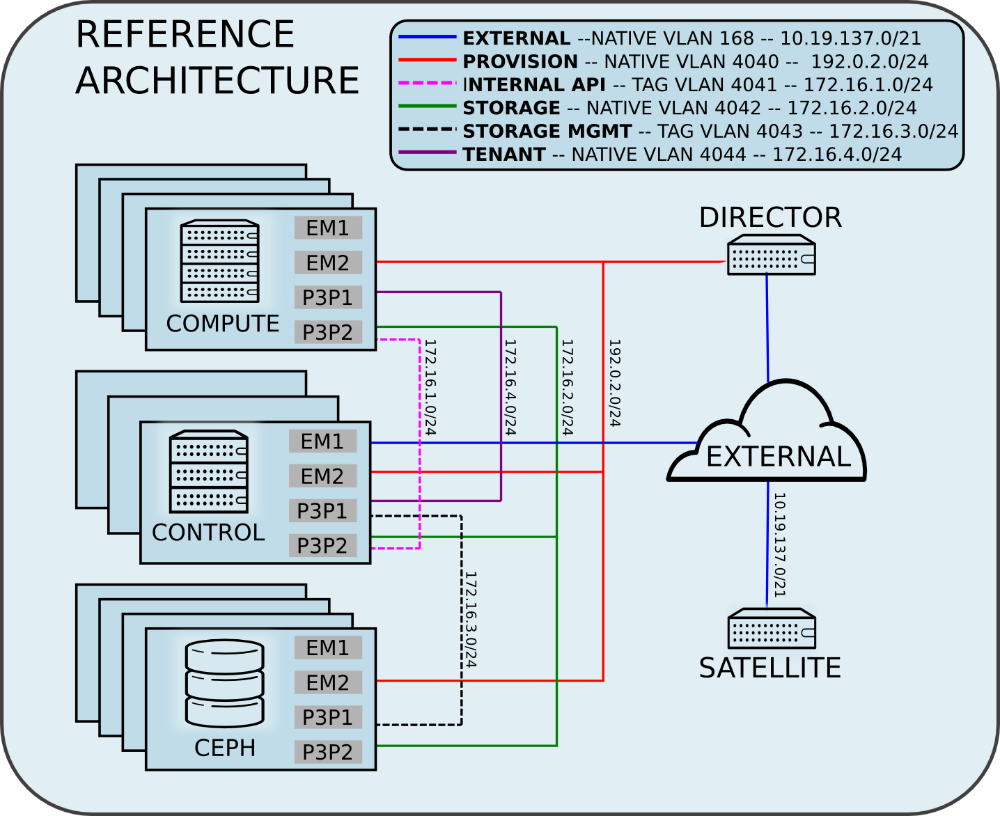

= Deploying HA Red Hat Enterprise Linux OpenStack Platform 7 via OSP director to run an EAP 6 Microservices Architecture
Jacob Liberman <jliberma@redhat.com>
v1.0, 2015-08-05
:description: Reference architecture
:doctype: book
:title-logo-image: 
// Settings:
:compat-mode:
:experimental:
:listing-caption: Listing
:icons: font
:toc:
:toclevels: 3
ifdef::backend-pdf[]
:pagenums:
:pygments-style: bw
:source-highlighter: pygments
endif::[]

[abstract]
//empty on purpose so that legal can be on separate page and not conflict with toc

<<<
 
100 East Davie Street + 
Raleigh NC 27601 USA + 
Phone: +1 919 754 3700 + 
Phone: 888 733 4281 + 
Fax: +1 919 754 3701 + 
PO Box 13588 + 
Research Triangle Park NC 27709 USA + 

Linux is a registered trademark of Linus Torvalds. Red Hat, Red Hat Enterprise Linux and the Red Hat "Shadowman" logo are registered trademarks of Red Hat, Inc. in the United States and other countries.
Microsoft and Windows are U.S. registered trademarks of Microsoft Corporation.
UNIX is a registered trademark of The Open Group.
Intel, the Intel logo and Xeon are registered trademarks of Intel Corporation or its subsidiaries in the United States and other countries.
All other trademarks referenced herein are the property of their respective owners.

© 2015 by Red Hat, Inc. This material may be distributed only subject to the terms and conditions set forth in the Open Publication License, V1.0 or later (the latest version is presently available at http://www.opencontent.org/openpub/).

The information contained herein is subject to change without notice. Red Hat, Inc. shall not be liable for technical or editorial errors or omissions contained herein.

Distribution of modified versions of this document is prohibited without the explicit permission of Red Hat Inc.

Distribution of this work or derivative of this work in any standard (paper) book form for commercial purposes is prohibited unless prior permission is obtained from Red Hat Inc.

The GPG fingerprint of the security@redhat.com key is:
CA 20 86 86 2B D6 9D FC 65 F6 EC C4 21 91 80 CD DB 42 A6 0E

Send feedback to refarch-feedback@redhat.com

<<<

== Comments and Feedback

In the spirit of open source, we invite anyone to provide feedback and comments on any reference architectures. Although we review our papers internally, sometimes issues or typographical errors are encountered. Feedback allows us to not only improve the quality of the papers we produce, but allows the reader to provide their thoughts on potential improvements and topic expansion to the papers.
Feedback on the papers can be provided by emailing refarch-feedback@redhat.com. Please refer to the title within the email.

=== Staying In Touch

Join us on some of the popular social media sites where we keep our audience informed on new reference architectures as well as offer related information on things we find interesting.

==== Like us on Facebook:
https://www.facebook.com/rhrefarch

==== Follow us on Twitter:
https://twitter.com/RedHatRefArch

==== Plus us on Google+
https://plus.google.com/u/0/b/114152126783830728030/

[abstract]
== Executive Summary
Red Hat Enterprise Linux OpenStack Platform 7 delivers an integrated
foundation to create, deploy, and scale an OpenStack cloud. RHEL OSP
7, Red Hat's 5th iteration of OpenStack Platform, is based on the Kilo
community OpenStack release. This reference architecture describes
a realistic use case for deploying a microservices architecture on RHEL
OSP 7 cluster. A microservice architecture is a complex, modular
enterprise applications where individual instances or containers run
single services and communicate via lightweight protocols and APIs. The
microservice architecture deployed in this reference architecture was
built using Red Hat JBOSS Enterprise Application Server 6, Red Hat's
fully-certified Java EE platform. This reference architecture supplements
existing documentation by providing a _comprehensive example_ of deploying
a complex enterprise web application on OpenStack, demonstrating OSP 7's
features and tools in a realistic context.

The reference architecture begins with steps for deploying OSP 7 on baremetal
servers via OSP director, Red Hat's new deployment toolchain. OSP director
combines functionality from the upstream TripleO and Ironic projects
with components from Red Hat's previous installers. Next it describes
Red Hat's approach to implementing highly available OpenStack.
Core OpenStack services are managed and monitored in a highly available
cluster. A load balancer provides access to the service endpoints. There
are no direct connections from the clients to the services. This
approach allows administrators to manage, operate, and scale services
together or independently. The reference architecture concludes with
instructions for implementing a microservices architecture that provides
shopping cart functionality via a multi-tier web application.

<<<

== Architecture Overview
Red Hat Enterprise Linux OpenStack Platform 7 delivers an integrated
foundation to create, deploy, and scale an OpenStack cloud. RHEL OSP
7, Red Hat's 5th iteration of OpenStack Platform, is based on the
community Kilo OpenStack release. Red Hat JBOSS Enterprise Application
Server 6 is a fully-certified Java EE platform to quickly deploy and
develop enterprise applications. This reference architecture describes
a realistic use case for deploying an EAP 6 microservices architecture
on a highly available RHEL OSP 7 cluster. It provides a comprehensive,
end-to-end example of depoying an OSP 7 cloud on baremetal using
OpenStack director then implementing the microservice architecture via
Heat templates.

[[OSP-director]]
.OpenStack Platform director
image::images/DIRECTOR.png[align="center",scaledwidth="50%"]

The first section of this reference architecture introduces the principal
components: Red Hat Enterprise Linux OpenStack Platform 7, OpenStack
Plaform director, and a microservices architecture built with Red Hat JBOSS
Enterprise Application Platform 6. It also describes Red Hat's
approach to making OpenStack highly availabile. The second section of
the paper describes the lab environment, hardware, and software used to
implement and test the reference architecture. The third section
documents the installation and configuration procedure as performed by the
Red Hat Systems Engineering team to deploy the reference architecture in their
lab on bare metal servers using OSP director and production code. This
reference architecture complements existing RHEL OSP documentation by
providing a realistic, comprehensive example of a complete deployment.

== OpenStack Platform 7 director

Red Hat Enterprise Linux OpenStack Platform (RHEL OSP) delivers an integrated 
foundation to create, deploy, and scale a secure and reliable public or private 
OpenStack cloud. RHEL OSP starts with the proven foundation of Red Hat
Enterprise Linux and integrates Red Hat's OpenStack Platform
technology to provide a production-ready cloud platform backed by an ecosystem 
of more than 350 certified partners.

RHEL OSP 7 is based on the community Kilo OpenStack release. This
release is Red Hat's fifth iteration of RHEL OSP which has been
successfully deployed by Red Hat customers worldwide across diverse
vertical industries including financial, telecommunications, and
education.

RHEL OSP 7 introduces OpenStack Platform director, a cloud installation and
lifecycle management toolchain. OSP director is the first
Red Hat OpenStack Platform installer to deploy OpenStack on and with
OpenStack. This section of the paper introduces RHEL OSP director's architecture
and describes the following features:

* Simplified deployment through ready-state provisioning of bare metal resources.
* Flexible network definitions
* High availability via tight integration with the RHEL Server High
  Availability Add-on
* Integrated setup and installation of Red Hat Ceph Storage 1.3
* Content management via the Red Hat Content Delivery
  Network (CDN) or Red Hat Satellite server

=== Ready State Provisioning and Server Roles
OSP director is a converged installer. It combines mature upstream
OpenStack deployment projects (TripleO and Ironic) with
components from Red Hat's past OpenStack Platform installers.

*TripleO* stands for "OpenStack on OpenStack." TripleO is an upstream
OpenStack project that uses an existing OpenStack environment to install 
a production OpenStack environment. The deployment environment is called 
the undercloud. The production environment is called the overcloud. 

The *undercloud* is TripleO's control plane. It uses native OpenStack APIs 
and services to deploy, configure, and manage the production OpenStack 
deployment. The undercloud defines the overcloud with Heat templates
then deploys it via the Ironic baremetal provisioning service. OSP director 
includes Heat predefined templates for the basic server roles that comprise 
the overcloud. Customized templates allow OSP director to deploy,
redeploy, and scale complex overclouds in a repeatable fashion.

*Ironic* is a community bare-metal provisioning project. OSP 
director uses Ironic to deploy the overcloud servers. Ironic
gathers information about baremetal servers via a discovery mechanism
known as introspection. Ironic pairs the servers with bootable disk
image and then installs them via PXE and remote power management. 

OSP director deploys all servers with the same generic image. During 
installation OSP director injects *Puppet modules* into the generic 
disk image to tailor it for specific server roles. OSP director also 
applies host-specific customizations via Puppet including network and 
storage configuration.

While the undercloud is primarily used to deploy OpenStack, the
*overcloud* is a functional cloud available to run virtual machines
and workloads. Servers in the following roles comprise the overcloud:

[[server-roles]]
[glossary]
*Control*::
    This role provides the endpoint for REST-based API queries to the
    majority of the OpenStack services. These include Compute, Image,
    Identity, Block, Network, and Data processing.  The controller can
    run as a standalone server or as a 3-16 node high availability
    (HA) cluster.
*Compute*::
    These servers provide the processing, memory, storage, and
    networking resources to run virtual machine instances. They run
    the KVM hypervisor by default. New instances are spawned across
    compute nodes in a round-robin fashion. 
*Block storage*::
    This role provides external block storage for HA controller nodes
    via the OpenStack Block Storage service (Cinder).
*Ceph storage*::
    Ceph is a distributed object store and file system. This role
    deploys Object Storage Daemon (OSD) nodes for Ceph clusters. It
    also installs the Ceph Monitor service on the controller.
*Object storage*::
    These servers provide external Account, Container, and Object
    (ACO) storage for the OpenStack Object Storage service (Swift.) It
    also installs a Swift proxy server on the controller nodes.

NOTE: The overcloud requires at least one controller and one compute
node. It runs independently from the undercloud once it is
installed. This reference architecture uses the Control, Compute, and Ceph
storage roles.

OSP director also includes *advanced hardware configuration* tools
from the eNovance SpinalStack installer. These tools validate server
hardware prior to installation. *Profile matching* lets administrators
specify hardware requirements for each server role. OSP director only
matches servers that meet minimum hardware requirements for each role.
Profile to matching is performed after introspection but prior to deployment. 

OSP director also supports pre-installation *benchmark collection*.
Servers boot to a customized RAMdisk and run a series of benchmarks.
The benchmarks report performance outliers to identify underperforming
nodes prior to installation. 

NOTE: RHEL OSP 7 requires Red Hat Enterprise Linux 7 Server on all servers.
Supported guest operating systems can be found at
https://access.redhat.com/articles/973163. Deployment limitations are
listed at https://access.redhat.com/articles/1436373.

=== Network Isolation
OpenStack requires multiple network functions. While it is possible to 
collapse all network functions onto a single network interface,
isolating communication streams in their own physical or virtual
networks generally provides better performance and scalability.

OSP director supports isolating network traffic by type. One or more 
network traffic types can be flexibily assigned to a physical,
virtual, or bonded interface. Multiple traffic types can be combined  
across the same physical interfaces or switches. 

OPS director supports network isolation for the following traffic
types:

[[traffic-types]]
[glossary]
*Provisioning*::
    The control plane installs the overcloud via this network. All cluster 
    nodes must have a physical interface attached to the provisioning network.
    This network must carry PXE traffic so it should be on a native
    VLAN. The provisioning interface can act as a default gateway for
    the overcloud if there is no other gateway on the network.
*External*::
    This network provides overcloud nodes with external connectivity.
    Controller nodes connect the external network to an Open vSwitch
    bridge and forward traffic originating from hyperviso instances through it.
*Internal API*::
    This network exposes internal OpenStack API endpoints for the
    overcloud nodes. It handles inter-service communication between
    both core OpenStack services and the supporting services.
*Tenant*::
    Virtual machines communicate over the tenant network. It supports
    three modes of operation: VXLAN, GRE, and VLAN. 
*Storage*::
    This network carries storage communication including Ceph, Cinder,
    and Swift traffic. Data-internsive OpenStack deployments should
    isolate Storage traffic on a dedicated high bandwidth interface.
*Storage Management*::
    Storage management communication can generate large amounts of
    network traffic. This network carries storage management traffic
    to reduce overhead on the other networks.

Network traffic types are assigned to network interfaces through Heat
customization before deploying the overcloud. OSP director supports
several network interface types including physical interfaces, bonded
interfaces, and either tagged or native 802.1Q VLANs.
interfaces

==== Network Types by Server Role
<<server-roles, Server roles>> were discussed in the previous section.
When using network isolation, server roles require access to specific
networks.

[[network-topology]]
.Network topology

.Network type by server role
[options="header, footer"]
|====
|Role|Network
.2+^.^|Undercloud|External
|Provisioning
.6+^.^|Control|External
|Provisioning
|Storage Mgmt
|Tenant
|Internal API
|Storage
.5+^.^|Compute|External
|Provisioning
|Tenant
|Internal API
|Storage
.5+^.^|Ceph storage|External
|Provisioning
|Storage Mgmt
|Internal API
|Storage
|====

NOTE: By default OSP director collapses all network traffic types onto a 
single network by default. This configuration is suitable for evaluation, 
proof of concept, and development. It is not recommended for production.

==== Tenant Network Types
OpenStack Platform 7 supports  tenant network communication through
the OpenStack Networking (Neutron) service. OpenStack Networking supports
overlapping IP address ranges across tenants via the Linux kernel's
network namespace capability. It also supports three default
networking types:

. *VLAN segmentation mode*: Each tenant is assigned a network subnet
  mapped to a 802.1q VLAN on the physical network. This tenant
  networking type requires VLAN-assignment to the appropriate switch
  ports on the physical network.
. *GRE overlay mode*: This mode isolates tenant traffic in virtual
  tunnels to provide Layer 2 network connectivity between virtual
  machine instances on different hypervisors. GRE does not require
  changes to the network switches and supports more unique network IDs
  than VLAN segmentation.
. *VXLAN* is an overlay method similar to GRE. VXLAN combines the ease
  and scalability of GRE with superior performance. It is the default 
  tenant network type used in OSP director deployments.

Although Red Hat certifies third-party network plug-ins, OSP director 
uses the ML2 network plugin with the Open vSwitch driver by default. 

NOTE: OSP director does not deploy Nova networking.

=== High Availability
OSP director's approach to highly available OpenStack leverages Red Hat's
internal expertise with distributed cluster systems. Most of
the technologies discussed in this section are available through the
Red Hat Enterprise Linux Server High Availability Add On. These
technologies are bundled with RHEL OSP 7 to provide cluster services
for production OSP 7 deployments.

==== Cluster Manager and Proxy Server
Two components drive HA for all core and non-core OpenStack
services: the *cluster manager* and the *proxy server*.

The cluster manager is responsible for the startup and recovery of an
inter-related services across a set of physical machines. It tracks
the cluster's internal state across multiple machines. State changes
trigger appropriate responses from the cluster manager to ensure
service availability and data integrity. 

Cluster managers offer the following benefits:

. Deterministic recovery of a complex, multi-machine application stack
. State awareness of other cluster machines to co-ordinate service
   startup and failover.
. Shared quourm calculation to determine majority/
. Data integrity through fencing. Machines running a non-responsive
   process are isolated to ensure they are not still responding to
   remote requests. Machines are typically fenced via a remotely
   accessible power switch or IPMI controller.
. Automated recovery of failed instances to prevent additional
   load-induced failures.

In OSP's HA model, clients do not directly connect to service
endpoints. Connection requests are routed to service endpoints by a
proxy server.

Benefits of using a proxy server include:

. Connections are load balanced across service endpoints
. Service requests can be monitored in a central location
. Cluster nodes can be added or removed without interrupting service

OSP director uses HAproxy and Pacemaker to manage HA services and load
balance connection requests. With the exception of RabbitMQ and
Galera, HAproxy distributes connection requests to active nodes in a
round-robin fashion. Galera and RabbitMQ use persistent options to
ensure requests go only to active and/or synched nodes. Pacemaker
checks service health at 1 second intervals. Timeout settings vary by
service. 

The combination of Pacemaker and HAproxy:

* Detects and recovers machine and application failures
* Starts and stops OpenStack services in the correct order
* Responds to cluster failures with appropriate actions including
  resource failover and machine restart and fencing
* Provides a thoroughly tested code base that has been used in
  production clusters across a variety of use cases

The following services deployed by OSP director do not benefit from
the proxy server:

. RabbitMQ
. memcached
. mongodb

Individual cluster services are discussed in the following section.

NOTE: OSP director uses Pacemaker and HAproxy for clustering. Red Hat
also supports manually deployed OSP 7 clustered with keepalived and
HAproxy. Manual installation is beyond the scope of this document.

==== Cluster models: Segregated versus Collapsed

Cluster services can be deployed across cluster nodes in
different combinations. The two primary approaches are segregated and 
collapsed. 

*Segregated* clusters run each service on dedicated clusters of three
or more nodes. Components are isolated and can be scaled individually.
Each service has its own virtual IP address. Segregating services
offers flexibility in service placement. Multiple services can be run
on the same physical nodes, or, in an extreme case, each service can
run on its own dedicated hardware.

[[segregated-cluster]]
.Segregated cluster
image::images/HA_SEGREGATED.png[align="center"]

<<segregated-cluster,This diagram>> depicts OpenStack service deployed
in a segregated cluster model. Red Hat supports OSP 7 services
deployed in a segregated model but it is beyond the scope of this
document.

*Collapsed* clusters run every service and component on the same set of
three or more nodes. Cluster services share the same virtual IP
address set. Collapsed services require fewer physical machines and
are simpler to implement and manage. 

Previous Red Hat OpenStack Platform installers deployed segregated
clusters. OSPd deploys overclouds as collapsed clusters. All
controller nodes run the same services. Service endpoints are bound to 
the same set of virtual IP addresses. The undercloud is not clustered.

<<collapsed-cluster, This diagram>> depicts OSP director's default
approach to deploying collapsed HA OpenStack services.

NOTE: Segregated and collapsed are the dominant approaches to
implementing HA clusters but hybrid approaches are also possible.
Segregate one or more components expected to cause a bottleneck into
individual clusters. Collapse the remained. Deploying a mixed cluster
is beyond the scope of this document.

==== Cluster Services and Quorum
Each clustered service operates in one of the following modes:

* *Active/active*: Requests are load balanced between multiple
  cluster nodes running the same services. Traffic intended for failed
  nodes is sent to the remaining nodes.
* *Active/passive*: A redundant copy of a running service is brought
  online when the primary node fails.
* *Hot Standby*: Connections are only routed to one of several active
  service endpoints. New connections are routed to a standby
  endpointif the primary service endpoint fails.
* *Managed*: Managed nodes do not run the full Pacemaker stack. They
  run _pacemaker_remoted_ which acts as a conduit to a remote
  Pacemaker stack. The remote Pacemaker stack triggers recovery action
  when the managed node is unreachable.
* *Single*: Each node runs an independent cluster manager that only
  monitors its local service. This allows nodes to be monitored and
  recovered beyond the 16-node limit of _pacemaker_remoted_.

A cluster *quorum* is the majority node set when a failure splits the
cluster into two or more partitions. In this situation the majority 
fences the minority to ensure both sides are not running the same 
services -- a so-called "split brain" situation. *Fencing* is the
process of isolating a failed machine -- typically via remote power
control or networked switches -- by powering it off. Tjis is necessary
to ensure data integrity.

NOTE: Although OSPd supports up to 16 cluster nodes, Red Hat
recommends an odd number of cluster members to help ensure quorum during
cluster communication failure. OSP director requires a minimum of three 
active cluster members to achieve quorum. 

==== Cluster Modes for Core Services
This section of the paper describes OSP director's default cluster mode for each
OpenStack service.

[[collapsed-cluster]]
.Collapsed cluster

The following table lists service mode by service.

.Service description
[options="header, footer"]
|====
|Service|Mode|Description
|*Ceilometer*|Active/active|Measures usage of core OpenStack
components. Used with Heat to trigger application autoscaling.
|*Cinder*|Active/Passive|Provides persistent block storage to virtual
machines. Cinder volume runs in active/passive mode to prevent potential https://bugzilla.redhat.com/show_bug.cgi?id=1193229[race conditions].
|*Glance*|Active/active|Discovers, catalogs, and retrieves virtual
machine images. 
|*Horizon*|Active/active|Web management interface runs via HTTPD in
active/active mode.
|*Keystone*|Active/active|Common OpenStack authentication system runs
in HTTPD.
|*Neutron*|Active/active|Neutron allows users to define and join
networks on demand. Supports both Layer 2 and 3 plus numerous virtual networking
technologies including ML2 and Open vSwitch.
|*Nova*|Active/active|Provides compute capabilties to deploy and run
virtual machine instances.
|*Swift proxy server*|Active/active|Routes data requests to the
appropriate Swift ACO server. 
|====

==== Cluster Modes for Supporting Services

The following tables lists the cluster mode for the non-core OpenStack
services.

.Supporting service description
[options="header, footer"]
|====
|Service|Mode|Description
|*Replicated state database*|Active/passive|Galera replicates databases
to decrease client latency and prevent lost transactions. Galera
supports multi-master but Red Hat recommends active/passive to avoid
lock contention.
|*Database cache*|Hot standby|Memory caching system. HAproxy does not
manage memcached connections because replicated access is still
experimental.
|*Message bus*|Active/active|AMQP message bus coordinates job
execution and ensures reliable delivery. Not handled by HAproxy.
Clients have a full RabbitMQ hosts. This prevents TCP transport
failures after Virtual IP movements.
|*NoSQL database*|Active/active|NoSQL database mongodb supports
Ceilometer and Heat. HAproxy does not handle mongodb access.
|====

==== Compute Node Clustering
Previous Red Hat OpenStack Platform installers deployed compute nodes
as single-node clusters in order to monitor their health and the
services running on them. This approach was limited by Corosync's
ability to monitor only 16 nodes.

The deployment model used by OSP director manages compute nodes using
the Pacemaker cluster on the control plane. The compute nodes run
_pacemaker_remoted_ instead of a full cluster stack. Pacemaker monitors
the _pacemaker_remoted_ connections to verify compute nodes are
reachable and trigger recovery actions. In the event of a failure,
Pacemaker uses _pacemaker_remoted_ to start compute node services in the
following sequence:

1. neutron-ovs-agent
2. ceilometer-compute
3. nova-compute

If a service fails to start, the node where the service is running
will be fenced in order to guarantee data integrity.

=== Ceph Storage Integration

[[ceph-integration]]
.Ceph Integration

<<<

== Reference Architecture Configuration Details

=== Objective

=== Workflow

[[reference-workflow]]
.Reference Architecture Workflow

== Conceptual Diagram of the Solution Stack
Figure XX depicts the solution stack including networks, server roles, and service placement.

[[reference-architecture]]
.Reference Architecture

=== Server Roles

=== Network Topology

Figure 2 shows the network topology of this reference architecture. 

?? Describe the network graphic

NOTE: The tenant network carries tenant network traffic over tagged VLANs. The interfaces connected to this network are not configured with IPv4 addresses by the OpenStack administrator. Instead, instances and services are allocated addresses within user-created subnets on tenant networks. Network namespaces prevent different users' subnets from conflicting with each other or with the infrastructure's own subnets.

=== Network Configuration

This reference architecture uses the network isolation feature to
segment openstack communication by type. The following network traffic
types are segmented:

* Provisioning
* Internal API
* Storage
* Storage Management
* Tenant
* External

In some cases more than one traffic type will share a physical
interface. This is because there are more traffic types than physical
interfaces in the servers. The network isolation feature uses both tagged and native VLANs to
segment network both within and across interfaces.

Each server has two Gigabit interfaces (nic1:2) and two 10-Gigabit
interfaces (nic3:4).

.Network isolation
[options="header, footer"]
|====
|Role|Interface|Network|VLAN ID|VLAN Type
.6+^.^|Undercloud|nic1|4041|External|Native
|nic2|168|Provisioning|Native
|nic3|4042|Storage Mgmt|Tagged
|nic3|4043|Tenant|Native
|nic4|4044|Internal API|Tagged
|nic4|4045|Storage|Native
.6+^.^|Control|nic1|4041|External|Native
|nic2|168|Provisioning|Native
|nic3|4042|Storage Mgmt|Tagged
|nic3|4043|Tenant|Native
|nic4|4044|Internal API|Tagged
|nic4|4045|Storage|Native
.6+^.^|Compute|nic1|4041|External|Native
|nic2|168|Provisioning|Native
|nic3|4042|Storage Mgmt|Tagged
|nic3|4043|Tenant|Native
|nic4|4044|Internal API|Tagged
|nic4|4045|Storage|Native
.6+^.^|Ceph storage|nic1|4041|External|Native
|nic2|168|Provisioning|Native
|nic3|4042|Storage Mgmt|Tagged
|nic3|4043|Tenant|Native
|nic4|4044|Internal API|Tagged
|nic4|4045|Storage|Native
|====

= Install OSP 7 with OSP-D
This section lists the steps that were followed to install and
configure OSP 7 with OSP-d in the Red Hat Systems Engineering lab. 

== Prepare the undercloud server

. Install the operating system

. Activate required channels

. Install the osc plugin.
[source, shell]
----
# rpm -q python-rdomanager-oscplugin
python-rdomanager-oscplugin-0.0.8-44.el7ost.noarch
----

. Set the hostname
[source, shell]
----
+ hostnamectl set-hostname rhos0.osplocal
+ hostnamectl set-hostname --transient rhos0.osplocal
+ export HOSTNAME=rhos0.osplocal
+ HOSTNAME=rhos0.osplocal
+ hostname
rhos0.osplocal
----

. Create the stack user
[source, shell]
----
+ useradd stack
+ echo stack:password
+ chpasswd
+ echo 'stack ALL=(root) NOPASSWD:ALL'
+ tee -a /etc/sudoers.d/stack
stack ALL=(root) NOPASSWD:ALL
+ chmod 0440 /etc/sudoers.d/stack
+ id stack
uid=1000(stack) gid=1000(stack) groups=1000(stack)
----

== Deploy the Control Plane

. Switch to the stack user account.
[source, shell]
----
# su - stack 
----

. The file undercloud.conf contains configuration data for the
  undercloud installation. Create the undercloud.conf.
  
[source, ruby, numbered]
----
  [DEFAULT]

  image_path = .
  local_ip = 192.0.2.1/24
  #undercloud_public_vip = 192.0.2.2
  #undercloud_admin_vip = 192.0.2.3
  #undercloud_service_certificate =
  local_interface = eno4
  masquerade_network = 192.0.2.0/24
  dhcp_start = 192.0.2.5
  dhcp_end = 192.0.2.24
  network_cidr = 192.0.2.0/24
  network_gateway = 192.0.2.1
  discovery_interface = br-ctlplane
  discovery_iprange = 192.0.2.100,192.0.2.120
  discovery_runbench = false
  undercloud_debug = true

  [auth]

  undercloud_db_password =
  undercloud_admin_token =
  undercloud_admin_password =
  undercloud_glance_password =
  undercloud_heat_encryption_key =
  undercloud_heat_password =
  undercloud_neutron_password =
  undercloud_nova_password =
  undercloud_ironic_password =
  undercloud_tuskar_password =
  undercloud_ceilometer_password =
  undercloud_ceilometer_metering_secret =
  undercloud_ceilometer_snmpd_user =
  undercloud_ceilometer_snmpd_password =
  undercloud_swift_password =
  undercloud_rabbit_cookie =
  undercloud_rabbit_password =
  undercloud_rabbit_username =
  undercloud_heat_stack_domain_admin_password =
  undercloud_swift_hash_suffix =
----

. Install the undercloud.
[source, shell]
----
$ openstack undercloud install 2> uc.err
----

. Source stackrc to set environment variables.
[source, shell]
----
$ source stackrc 

$ env | grep OS_
OS_PASSWORD=8597924e5cd20db4b34a547ca6975c4c3fe4f691
OS_AUTH_URL=http://192.0.2.1:5000/v2.0
OS_USERNAME=admin
OS_TENANT_NAME=admin
OS_NO_CACHE=True
----

. Check status of openstack-services. All services should be active.
[source, shell]
----
$ openstack-service status
neutron-dhcp-agent (pid 16624) is active
neutron-openvswitch-agent (pid 17874) is active
neutron-server (pid 16672) is active
openstack-ceilometer-alarm-evaluator (pid 16288) is active
openstack-ceilometer-alarm-notifier (pid 16228) is active
openstack-ceilometer-api (pid 16257) is active
openstack-ceilometer-central (pid 16197) is active
openstack-ceilometer-collector (pid 16168) is active
openstack-ceilometer-notification (pid 16139) is active
openstack-glance-api (pid 17139) is active
openstack-glance-registry (pid 17074) is active
openstack-heat-api-cfn (pid 17903) is active
openstack-heat-api-cloudwatch (pid 18158) is active
openstack-heat-api (pid 18062) is active
openstack-heat-engine (pid 18025) is active
openstack-ironic-api (pid 14801) is active
openstack-ironic-conductor (pid 19167) is active
openstack-ironic-discoverd-dnsmasq (pid 20046) is active
openstack-ironic-discoverd (pid 20052) is active
openstack-keystone (pid 16786) is active
openstack-nova-api (pid 17272) is active
openstack-nova-compute (pid 19939) is active
openstack-nova-conductor (pid 17459) is active
openstack-nova-consoleauth (pid 17236) is active
openstack-nova-scheduler (pid 17421) is active
openstack-swift-account-auditor (pid 15664) is active
openstack-swift-account-reaper (pid 15639) is active
openstack-swift-account-replicator (pid 15954) is active
openstack-swift-account (pid 15979) is active
openstack-swift-container-auditor (pid 15751) is active
openstack-swift-container-replicator (pid 16043) is active
openstack-swift-container-updater (pid 16593) is active
openstack-swift-container (pid 16068) is active
openstack-swift-object-auditor (pid 15834) is active
openstack-swift-object-replicator (pid 16432) is active
openstack-swift-object-updater (pid 15859) is active
openstack-swift-object (pid 16403) is active
openstack-swift-proxy (pid 16334) is active
openstack-tuskar-api (pid 20076) is active
----

. Get the images

. Upload the images
[source, shell]
----
$ openstack overcloud image upload

$ openstack image list
+--------------------------------------+------------------------+
| ID                                   | Name                   |
+--------------------------------------+------------------------+
| 10287a14-ed9d-4767-9088-1b8132f6b4bb | bm-deploy-ramdisk      |
| 2f237f37-7203-492e-b99f-3f64b6baa7e4 | bm-deploy-kernel       |
| 3984add9-d298-4598-904f-99d82531121a | overcloud-full         |
| be617ff4-853d-4b03-83ea-d4e10bc8399f | overcloud-full-initrd  |
| bdbd5a52-2307-4baa-abc7-12370b8ed396 | overcloud-full-vmlinuz |
+--------------------------------------+------------------------+
----

== Deploy the Overcloud
This section describes steps for deploying the overcloud. 

. Create the host definition file. The openstack-ironic-discoverd
  service uses this file to discover nodes and populate the ironic
  database.

NOTE: The example below is truncated for brevity. Appendix [link to
appendix] contains the full file. 
[source,ruby,numbered]
----
{
  "nodes": [
    {
      "pm_password": "100Mgmt-",
      "pm_type": "pxe_ipmitool",
      "mac": [
        "d4:ae:52:b2:20:d2"
      ],
      "cpu": "24",
      "memory": "49152",
      "disk": "500",
      "arch": "x86_64",
      "pm_user": "root",
      "pm_addr": "10.19.143.153"
    },
    {
      "pm_password": "100Mgmt-",
      "pm_type": "pxe_ipmitool",
      "mac": [
        "54:9F:35:F6:70:70"
      ],
      "cpu": "32",
      "memory": "98304",
      "disk": "130",
      "arch": "x86_64",
      "pm_user": "root",
      "pm_addr": "10.19.143.37"
     }
  ]
}
----

. Register the nodes with ironic.
[source, shell]
----
$ *openstack baremetal import --json ~/instackenv.json*

$ *openstack baremetal list*
+--------------------------------------+------+---------------+-------------+-----------------+-------------+
| UUID                                 | Name | Instance UUID | Power
State | Provision State | Maintenance |
+--------------------------------------+------+---------------+-------------+-----------------+-------------+
| 1e8d1fbc-7355-4de3-a1cb-5de7c0f54808 | None | None          | power
off   | available       | False       |
| de5d489a-8232-4a98-b43b-531f6da21866 | None | None          | power
off   | available       | False       |
| c9eb5e27-5815-4f9e-95f9-7854753951d9 | None | None          | power
off   | available       | False       |
| 4eedcd08-b901-433a-99c1-239da5279b9a | None | None          | power
off   | available       | False       |
| 956418e8-5c64-45cd-af66-8e771077b987 | None | None          | power
off   | available       | False       |
| f89038eb-0631-4682-b635-10ac1cf3a265 | None | None          | power
off   | available       | False       |
| 921fbec6-7fa0-4db4-b3a4-38878aa0694f | None | None          | power
off   | available       | False       |
| 1cb6ac7e-8cf2-4aff-80e9-f8e103d30fc7 | None | None          | power
off   | available       | False       |
| ba083e12-2519-4eed-9489-3f2abcf7832f | None | None          | power
off   | available       | False       |
| bea915fd-c4bc-4931-b8b6-ad175be42f4f | None | None          | power
off   | available       | False       |
| a609e230-7cdd-4ee5-a660-f1e55cf4f5a7 | None | None          | power
off   | available       | False       |
+--------------------------------------+------+---------------+-------------+-----------------+-------------+
----

. Assign a kernel and ramdisk to the nodes
[source, shell]
----
$ *openstack baremetal configure boot*
----

. Introspect the nodes to discover their hardware attributes.
[source, shell]
----
$ *openstack baremetal introspection bulk start*
----

Bulk introspection time will vary based on the number of
physical nodes and their individual boot times. For this reference
architecture bulk introspection lasted approximately 3 minutes per
node. 

. Use journalctl to view introspection progress in a separate
  terminal.
[source, shell]
----
$ *sudo journalctl -l -u openstack-ironic-discoverd -u
openstack-ironic-discoverd-dnsmasq -u openstack-ironic-conductor |
tailf*
Aug 06 10:23:00 rhos0.osplocal ironic-conductor[19167]: 2015-08-06
10:23:00.307 19167 DEBUG oslo_concurrency.processutils [-] Running cmd
(subprocess): ipmitool -I lanplus -H 10.19.143.37 -L ADMINISTRATOR -U
root -R 12 -N 5 -f /tmp/tmpm55PAU power status execute
/usr/lib/python2.7/site-packages/oslo_concurrency/processutils.py:199
Aug 06 10:23:00 rhos0.osplocal dnsmasq-dhcp[20046]:
DHCPREQUEST(br-ctlplane) 192.0.2.105 54:9f:35:f6:70:3c
Aug 06 10:23:00 rhos0.osplocal dnsmasq-dhcp[20046]:
DHCPACK(br-ctlplane) 192.0.2.105 54:9f:35:f6:70:3c
Aug 06 10:23:00 rhos0.osplocal ironic-conductor[19167]: 2015-08-06
10:23:00.366 19167 DEBUG oslo_concurrency.processutils [-] CMD
"ipmitool -I lanplus -H 10.19.143.37 -L ADMINISTRATOR -U root -R 12 -N
5 -f /tmp/tmpm55PAU power status" returned: 0 in 0.059s execute
/usr/lib/python2.7/site-packages/oslo_concurrency/processutils.py:225
----

. Verify nodes completed introspection without errors.
[source, shell]
----
$ openstack baremetal introspection bulk status
+--------------------------------------+----------+-------+
| Node UUID                            | Finished | Error |
+--------------------------------------+----------+-------+
| 1e8d1fbc-7355-4de3-a1cb-5de7c0f54808 | True     | None  |
| de5d489a-8232-4a98-b43b-531f6da21866 | True     | None  |
| c9eb5e27-5815-4f9e-95f9-7854753951d9 | True     | None  |
| 4eedcd08-b901-433a-99c1-239da5279b9a | True     | None  |
| 956418e8-5c64-45cd-af66-8e771077b987 | True     | None  |
| f89038eb-0631-4682-b635-10ac1cf3a265 | True     | None  |
| 921fbec6-7fa0-4db4-b3a4-38878aa0694f | True     | None  |
| 1cb6ac7e-8cf2-4aff-80e9-f8e103d30fc7 | True     | None  |
| ba083e12-2519-4eed-9489-3f2abcf7832f | True     | None  |
| bea915fd-c4bc-4931-b8b6-ad175be42f4f | True     | None  |
| a609e230-7cdd-4ee5-a660-f1e55cf4f5a7 | True     | None  |
+--------------------------------------+----------+-------+
----

=== Configure hardware profiles

. Create the default flavor for baremetal deployments.
[source, shell]
----
$ *openstack flavor create --id auto --ram 4096 --disk
40 --vcpus 1 baremetal*
+----------------------------+--------------------------------------+
| Field                      | Value                                |
+----------------------------+--------------------------------------+
| OS-FLV-DISABLED:disabled   | False                                |
| OS-FLV-EXT-DATA:ephemeral  | 0                                    |
| disk                       | 40                                   |
| id                         | 61209bd2-d573-4e9c-b0ec-8be332c4582f |
| name                       | baremetal                            |
| os-flavor-access:is_public | True                                 |
| ram                        | 4096                                 |
| rxtx_factor                | 1.0                                  |
| swap                       |                                      |
| vcpus                      | 1                                    |
+----------------------------+--------------------------------------+
----

. Set properties for the baremetal flavor.
[source, shell]
----
$ *openstack flavor set --property "cpu_arch"="x86_64"
--property "capabilities:boot_option"="local" baremetal*
+----------------------------+-----------------------------------------------------+
| Field                      | Value
+----------------------------+-----------------------------------------------------+
| OS-FLV-DISABLED:disabled   | False
| OS-FLV-EXT-DATA:ephemeral  | 0
| disk                       | 40
| id                         | 61209bd2-d573-4e9c-b0ec-8be332c4582f
| name                       | baremetal
| os-flavor-access:is_public | True
| properties                 | capabilities:boot_option='local', cpu_arch='x86_64' 
| ram                        | 4096
| rxtx_factor                | 1.0
| swap                       |
| vcpus                      | 1
+----------------------------+-----------------------------------------------------+
----

.

=== Configure network isolation

=== Configure Ceph Storage

=== Deploy the Overcloud servers

= Test the Overcloud

== Configure controller fencing

== Test Basic Functionality

<<<

= Install and Configure EAP 6
This ection describes the steps to install and configure an example
EAP application on the deployed cloud. The example EAP application is
a multi-tier web application with a shopping cart.

Red Hat® JBoss® Enterprise Application Platform (EAP) is a fully certified 
Java™ EE platform for developing and deploying enterprise
applications. This reference architecture documents the steps to
deploy an EAP 6 Microservices Architecture (MSA) on OSP 7. MSA is
software architectural style that increases modularity to decrease
complexity. Applications are developed from suites of small services
running as an independent process in its own container or
virtual machine. Each service has a single responsibility. The
services communicate with standard lightweight protocols and APIs,
such as REST of HTTP. 

More information about Red Hat JBOSS EAP can be found at
https://access.redhat.com/products/red-hat-jboss-enterprise-application-platform.

The MSA used in this reference architecture is an example of Business-Driven 
Microservices. The services in the application do not communicate
directly with one another. A web application aggregates and
coordinates communication between the services. Its acts as a
perimeter between the application and the clients. By employing this
presentation layer, the microservices remain indepdent from each other.
They can be developed, scaled, and maintained independently, which avoids
many of the complexities inherent to other MSA approaches.

More information on depoying a RHEL JBOSS EAP 6 MSA can be found at
https://access.redhat.com/articles/1452603[ Microservice Architecture:
Building Microservices with JBOSS EAP 6]. 

OpenStack Platform 7 provides a comprehensive platform for implementing, 
maintaining, and scaling a MSA. 

[[EAP6-MSA]]
.EAP6 Microservices Architecture
image::images/EAP6_MSA.png[align="center"]

== Define heat templates

== Deploy instances

== Install EAP

== Test EAP server

[[EAP6-web]]
.EAP6 Web Interface

<<<

= Conclusion

[appendix]
== Revision History

[appendix]
== References

[appendix]
== Hardware specifications

.Hardware specifications
[options="header,footer"]
|====
|Count|Model|Description
|8|Dell PowerEdge M520|2x Intel Xeon CPU E5-2450 0 @ 2.10GHz, Broadcom 5720 1Gb Dual Port LOMs, Broadcom 57810S-k
Dual Port 10Gb NIC, 6x DDR3 8192 MB @1333 MHZ DIMMs, 2 x 146GB SAS
internal disk drives
|4|Dell PowerEdge R520|2x Intel(R) Xeon(R) CPU X5650 @ 2.67 GHz (6
core), 2 x Broadcom NetXtreme II BCM5709S Gb Ethernet, 2x  Emulex
Corporation OneConnect 10Gb NIC, 6 x DDR3 8192 MB @1333 MHZ DIMMs, 12x
146GB SAS internal disk drives
|1|Dell PowerEdge M720|2x Intel(R) Xeon(R) CPU X5650 @ 2.67 GHz (6
core), 2 x Broadcom NetXtreme II BCM5709S Gb Ethernet, 2x  Emulex
Corporation OneConnect 10Gb NIC, 6 x DDR3 8192 MB @1333 MHZ DIMMs, 12x
146GB SAS internal disk drives
|====

[appendix]
== Service placement
This table lists the service placement for all OpenStack services. 

.Service placement
[options="header,footer"]
|====
|Role|Count|Services
.17+^.^|Undercloud .17+^.^|1|rabbitmq|neutron-server|openstack-cinder-api|openstack-cinder-scheduler|openstack-cinder-volume|openstack-glance-api|openstack-glance-registry|openstack-heat-api-cfn|openstack-heat-api|openstack-heat-engine|openstack-keystone|openstack-nova-api|openstack-nova-cert|openstack-nova-conductor|openstack-nova-consoleauth|openstack-nova-novncproxy|openstack-nova-scheduler
.4+^.^|Control .4+^.^|3|neutron-dhcp-agent|neutron-l3-agent|neutron-metadata-agent|neutron-openvswitch-agent
.2+^.^|Compute .2+^.^|4|neutron-openvswitch-agent|openstack-nova-compute
.3+^.^|Ceph Storage .3+^.^|3|openstack-swift-account|openstack-swift-container|openstack-swift-object
|====

[appendix]
== Required channels
Red Hat Enterprise Linux OpenStack Platform is available via Red Hat
Network Certificate Server repositories.

.Required channels
[options="header,footer"]
|====
|Channel|Source
|rhel-x86_64-server-7|RHN Classic
|rhel-x86_64-server-7-ost-6|RHN Classic
|rhel-7-server-rpms|RHN Certificate
|rhel-7-server-openstack-6.0-rpms|RHN Certificate
|rhel-7-server-rh-common-rpms|RHN Certificate
|====

NOTE: This reference architecture uses a local satellite server for
deployments and updates.

[appendix]
== instackenv.json
[source,ruby,numbered]
----

{
  "nodes": [
    {
      "pm_password": "100Mgmt-",
      "pm_type": "pxe_ipmitool",
      "mac": [
        "d4:ae:52:b2:20:d2"
      ],
      "cpu": "24",
      "memory": "49152",
      "disk": "500",
      "arch": "x86_64",
      "pm_user": "root",
      "pm_addr": "10.19.143.153"
    },
    {
      "pm_password": "100Mgmt-",
      "pm_type": "pxe_ipmitool",
      "mac": [
        "d4:ae:52:b2:28:95"
      ],
      "cpu": "24",
      "memory": "49152",
      "disk": "500",
      "arch": "x86_64",
      "pm_user": "root",
      "pm_addr": "10.19.143.154"
    },
    {
      "pm_password": "100Mgmt-",
      "pm_type": "pxe_ipmitool",
      "mac": [
        "d4:ae:52:b2:1c:37"
      ],
      "cpu": "24",
      "memory": "49152",
      "disk": "500",
      "arch": "x86_64",
      "pm_user": "root",
      "pm_addr": "10.19.143.151"
    },
    {
      "pm_password": "100Mgmt-",
      "pm_type": "pxe_ipmitool",
      "mac": [
        "d4:ae:52:b2:2e:80"
      ],
      "cpu": "24",
      "memory": "49152",
      "disk": "500",
      "arch": "x86_64",
      "pm_user": "root",
      "pm_addr": "10.19.143.152"
    },
    {
      "pm_password": "100Mgmt-",
      "pm_type": "pxe_ipmitool",
      "mac": [
        "54:9f:35:f6:70:22"
      ],
      "cpu": "32",
      "memory": "98304",
      "disk": "130",
      "arch": "x86_64",
      "pm_user": "root",
      "pm_addr": "10.19.143.31"
    },
    {
      "pm_password": "100Mgmt-",
      "pm_type": "pxe_ipmitool",
      "mac": [
        "54:9F:35:F6:70:2F"
      ],
      "cpu": "32",
      "memory": "98304",
      "disk": "130",
      "arch": "x86_64",
      "pm_user": "root",
      "pm_addr": "10.19.143.32"
    },
    {
      "pm_password": "100Mgmt-",
      "pm_type": "pxe_ipmitool",
      "mac": [
        "54:9F:35:F6:70:3C"
      ],
      "cpu": "32",
      "memory": "98304",
      "disk": "130",
      "arch": "x86_64",
      "pm_user": "root",
      "pm_addr": "10.19.143.33"
    },
    {
      "pm_password": "100Mgmt-",
      "pm_type": "pxe_ipmitool",
      "mac": [
        "54:9F:35:F6:70:49"
      ],
      "cpu": "32",
      "memory": "98304",
      "disk": "130",
      "arch": "x86_64",
      "pm_user": "root",
      "pm_addr": "10.19.143.34"
    },
    {
      "pm_password": "100Mgmt-",
      "pm_type": "pxe_ipmitool",
      "mac": [
        "54:9F:35:F6:70:56"
      ],
      "cpu": "32",
      "memory": "98304",
      "disk": "130",
      "arch": "x86_64",
      "pm_user": "root",
      "pm_addr": "10.19.143.35"
   },
    {
      "pm_password": "100Mgmt-",
      "pm_type": "pxe_ipmitool",
      "mac": [
        "54:9F:35:F6:70:63"
      ],
      "cpu": "32",
      "memory": "98304",
      "disk": "130",
      "arch": "x86_64",
      "pm_user": "root",
      "pm_addr": "10.19.143.36"
     },
    {
      "pm_password": "100Mgmt-",
      "pm_type": "pxe_ipmitool",
      "mac": [
        "54:9F:35:F6:70:70"
      ],
      "cpu": "32",
      "memory": "98304",
      "disk": "130",
      "arch": "x86_64",
      "pm_user": "root",
      "pm_addr": "10.19.143.37"
     }
  ]
}
----

// vim: set syntax=asciidoc:
