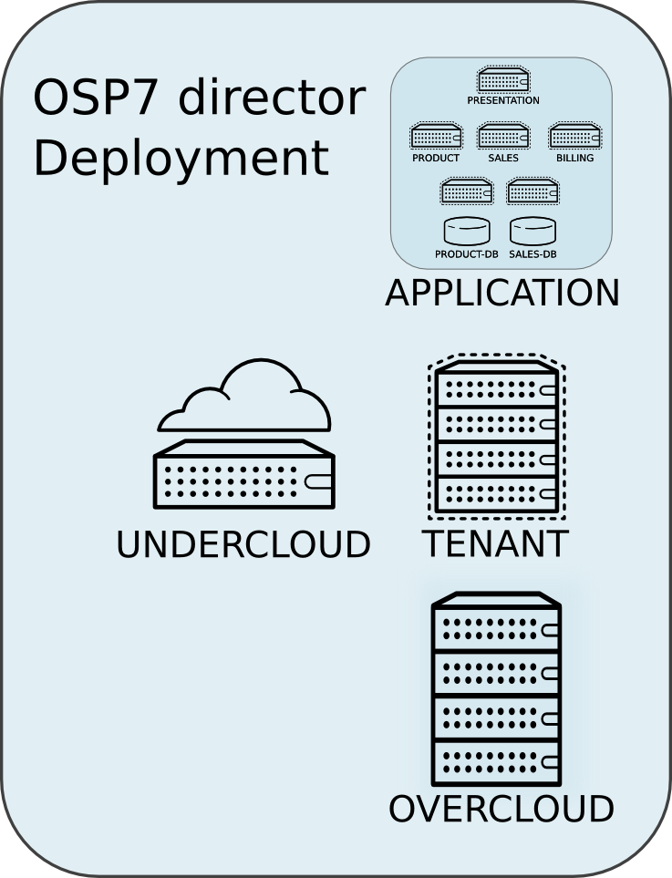
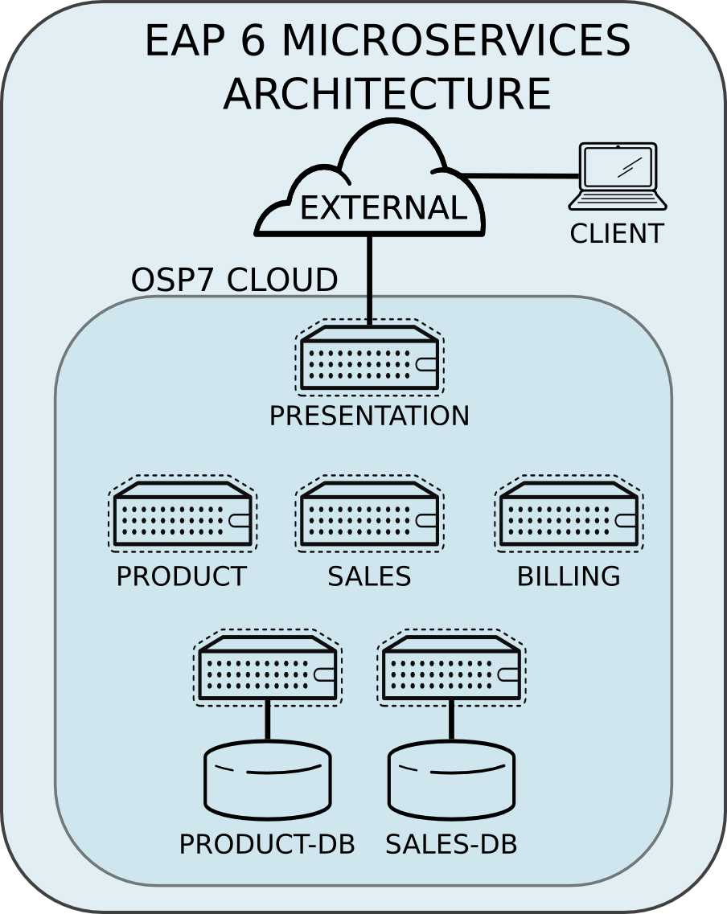

= Deploying an EAP 6 Microservices Architecture on HA OSP 7 via OSP director
Jacob Liberman <jliberma@redhat.com>
v1.0, 2015-08-05
:description: Reference architecture
:doctype: book
:title-logo-image: image:images/rh-ra-banner.jpg[scaledwidth=70%,align=center]
// Settings:
:compat-mode:
:experimental:
:listing-caption: Listing
:icons: font
:toc:
:toclevels: 3
ifdef::backend-pdf[]
:pagenums:
:pygments-style: bw
:source-highlighter: pygments
endif::[]

[abstract]
//empty on purpose so that legal can be on separate page and not conflict with toc

<<<
 
100 East Davie Street + 
Raleigh NC 27601 USA + 
Phone: +1 919 754 3700 + 
Phone: 888 733 4281 + 
Fax: +1 919 754 3701 + 
PO Box 13588 + 
Research Triangle Park NC 27709 USA + 

Linux is a registered trademark of Linus Torvalds. Red Hat, Red Hat Enterprise Linux and the Red Hat "Shadowman" logo are registered trademarks of Red Hat, Inc. in the United States and other countries.
Microsoft and Windows are U.S. registered trademarks of Microsoft Corporation.
UNIX is a registered trademark of The Open Group.
Intel, the Intel logo and Xeon are registered trademarks of Intel Corporation or its subsidiaries in the United States and other countries.
All other trademarks referenced herein are the property of their respective owners.

© 2015 by Red Hat, Inc. This material may be distributed only subject to the terms and conditions set forth in the Open Publication License, V1.0 or later (the latest version is presently available at http://www.opencontent.org/openpub/).

The information contained herein is subject to change without notice. Red Hat, Inc. shall not be liable for technical or editorial errors or omissions contained herein.

Distribution of modified versions of this document is prohibited without the explicit permission of Red Hat Inc.

Distribution of this work or derivative of this work in any standard (paper) book form for commercial purposes is prohibited unless prior permission is obtained from Red Hat Inc.

The GPG fingerprint of the security@redhat.com key is:
CA 20 86 86 2B D6 9D FC 65 F6 EC C4 21 91 80 CD DB 42 A6 0E

Send feedback to refarch-feedback@redhat.com

<<<

== Comments and Feedback

In the spirit of open source, we invite anyone to provide feedback and comments on any reference architectures. Although we review our papers internally, sometimes issues or typographical errors are encountered. Feedback allows us to not only improve the quality of the papers we produce, but allows the reader to provide their thoughts on potential improvements and topic expansion to the papers.
Feedback on the papers can be provided by emailing refarch-feedback@redhat.com. Please refer to the title within the email.

=== Staying In Touch

Join us on some of the popular social media sites where we keep our audience informed on new reference architectures as well as offer related information on things we find interesting.

==== Like us on Facebook:
https://www.facebook.com/rhrefarch

==== Follow us on Twitter:
https://twitter.com/RedHatRefArch

==== Plus us on Google+
https://plus.google.com/u/0/b/114152126783830728030/

[abstract]
== Executive Summary
Red Hat Enterprise Linux OpenStack Platform 7 delivers an integrated
foundation to create, deploy, and scale an OpenStack cloud. RHEL OSP
7, Red Hat's 5th iteration of OpenStack Platform, is based on the Kilo
community OpenStack release. This reference architecture describes
a realistic use case for deploying a microservices architecture on RHEL
OSP 7 cluster. A microservice architecture is a complex, modular
enterprise applications where individual instances or containers run
single services and communicate via lightweight protocols and APIs. The
microservice architecture deployed in this reference architecture was
built using Red Hat JBOSS Enterprise Application Server 6, Red Hat's
fully-certified Java EE platform. This reference architecture supplements
existing documentation by providing a _comprehensive example_ of deploying
a complex enterprise web application on OpenStack, demonstrating OSP 7's
features and tools in a realistic context.

The reference architecture begins with steps for deploying OSP 7 on baremetal
servers via OSP director, Red Hat's new deployment toolchain. OSP director
combines functionality from the upstream TripleO and Ironic projects
with components from Red Hat's previous installers. Next it describes
Red Hat's approach to implementing highly available OpenStack.
Core OpenStack services are managed and monitored in a highly available
cluster. A load balancer provides access to the service endpoints. There
are no direct connections from the clients to the services. This
approach allows administrators to manage, operate, and scale services
together or independently. The reference architecture concludes with
instructions for implementing a microservices architecture that provides
shopping cart functionality via a multi-tier web application.

<<<

== Architecture Overview
Red Hat Enterprise Linux OpenStack Platform 7 delivers an integrated
foundation to create, deploy, and scale an OpenStack cloud. RHEL OSP
7, Red Hat's 5th iteration of OpenStack Platform, is based on the
community Kilo OpenStack release. Red Hat JBOSS Enterprise Application
Server 6 is a fully-certified Java EE platform to quickly deploy and
develop enterprise applications. This reference architecture describes
a realistic use case for deploying an EAP 6 microservices architecture
on a highly available RHEL OSP 7 cluster. It provides a comprehensive,
end-to-end example of depoying an OSP 7 cloud on baremetal using
OpenStack director then implementing the microservice architecture via
Heat templates.

[[OSP-director]]
.OpenStack Platform director

The first section of this reference architecture introduces the principal
components: Red Hat Enterprise Linux OpenStack Platform 7, OpenStack
Plaform director, and a microservices architecture built with Red Hat JBOSS
Enterprise Application Platform 6. It also describes Red Hat's
approach to making OpenStack highly availabile. The second section of
the paper describes the lab environment, hardware, and software used to
implement and test the reference architecture. The third section
documents the installation and configuration procedure as performed by the
Red Hat Systems Engineering team to deploy the reference architecture in their
lab on bare metal servers using OSP director and production code. This
reference architecture complements existing RHEL OSP documentation by
providing a realistic, comprehensive example of a complete deployment.

== OpenStack Platform 7 director

Red Hat Enterprise Linux OpenStack Platform (RHEL OSP) delivers an integrated 
foundation to create, deploy, and scale a secure and reliable public or private 
OpenStack cloud. RHEL OSP starts with the proven foundation of Red Hat
Enterprise Linux and integrates Red Hat's OpenStack Platform
technology to provide a production-ready cloud platform backed by an ecosystem 
of more than 350 certified partners.

RHEL OSP 7 is based on the community Kilo OpenStack release. This
release is Red Hat's fifth iteration of RHEL OSP which has been
successfully deployed by Red Hat customers worldwide across diverse
vertical industries including financial, telecommunications, and
education.

RHEL OSP 7 introduces OpenStack Platform director, a cloud installation and
lifecycle management toolchain. OSP director is the first
Red Hat OpenStack Platform installer to deploy OpenStack on and with
OpenStack. This section of the paper introduces RHEL OSP director's architecture
and describes the following features:

* Simplified deployment through ready-state provisioning of bare metal resources.
* Flexible network definitions
* High availability via tight integration with the RHEL Server High
  Availability Add-on
* Integrated setup and installation of Red Hat Ceph Storage 1.3
* Content management via the Red Hat Content Delivery
  Network (CDN) or Red Hat Satellite server

=== Ready State Provisioning and Server Roles
OSP director is a converged installer. It combines mature upstream
OpenStack deployment projects (TripleO and Ironic) with
components from Red Hat's past OpenStack Platform installers.

*TripleO* stands for "OpenStack on OpenStack." TripleO is an upstream
OpenStack project that uses an existing OpenStack environment to install 
a production OpenStack environment. The deployment environment is called 
the undercloud. The production environment is called the overcloud. 

The *undercloud* is TripleO's control plane. It uses native OpenStack APIs 
and services to deploy, configure, and manage the production OpenStack 
deployment. The undercloud defines the overcloud with Heat templates
then deploys it via the Ironic baremetal provisioning service. OSP director 
includes Heat predefined templates for the basic server roles that comprise 
the overcloud. Customized templates allow OSP director to deploy,
redeploy, and scale complex overclouds in a repeatable fashion.

*Ironic* is a community bare-metal provisioning project. OSP 
director uses Ironic to deploy the overcloud servers. Ironic
gathers information about baremetal servers via a discovery mechanism
known as introspection. Ironic pairs the servers with bootable disk
image and then installs them via PXE and remote power management. 

OSP director deploys all servers with the same generic image. During 
installation OSP director injects *Puppet modules* into the generic 
disk image to tailor it for specific server roles. OSP director also 
applies host-specific customizations via Puppet including network and 
storage configuration.

While the undercloud is primarily used to deploy OpenStack, the
*overcloud* is a functional cloud available to run virtual machines
and workloads. Servers in the following roles comprise the overcloud:

[[server-roles]]
[glossary]
*Control*::
    This role provides the endpoint for REST-based API queries to the
    majority of the OpenStack services. These include Compute, Image,
    Identity, Block, Network, and Data processing.  The controller can
    run as a standalone server or as a 3-16 node high availability
    (HA) cluster.
*Compute*::
    These servers provide the processing, memory, storage, and
    networking resources to run virtual machine instances. They run
    the KVM hypervisor by default. New instances are spawned across
    compute nodes in a round-robin fashion. 
*Block storage*::
    This role provides external block storage for HA controller nodes
    via the OpenStack Block Storage service (Cinder).
*Ceph storage*::
    Ceph is a distributed object store and file system. This role
    deploys Object Storage Daemon (OSD) nodes for Ceph clusters. It
    also installs the Ceph Monitor service on the controller.
*Object storage*::
    These servers provide external Account, Container, and Object
    (ACO) storage for the OpenStack Object Storage service (Swift.) It
    also installs a Swift proxy server on the controller nodes.

NOTE: The overcloud requires at least one controller and one compute
node. It runs independently from the undercloud once it is
installed. This reference architecture uses the Control, Compute, and Ceph
storage roles.

OSP director also includes *advanced hardware configuration* tools
from the eNovance SpinalStack installer. These tools validate server
hardware prior to installation. *Profile matching* lets administrators
specify hardware requirements for each server role. OSP director only
matches servers that meet minimum hardware requirements for each role.
Profile to matching is performed after introspection but prior to deployment.

OSP director also supports pre-installation *benchmark collection*.
Servers boot to a customized RAMdisk and run a series of benchmarks.
The benchmarks report performance outliers to identify underperforming
nodes prior to installation.

NOTE: RHEL OSP 7 requires Red Hat Enterprise Linux 7 Server on all servers.
Supported guest operating systems can be found at
https://access.redhat.com/articles/973163. Deployment limitations are
listed at https://access.redhat.com/articles/1436373.

=== Network Isolation
OpenStack requires multiple network functions. While it is possible to
collapse all network functions onto a single network interface,
isolating communication streams in their own physical or virtual
networks generally provides better performance and scalability.

OSP director supports isolating network traffic by type. One or more
network traffic types can be flexibily assigned to a physical,
virtual, or bonded interface. Multiple traffic types can be combine
across the same physical interfaces or switches.

OPS director supports network isolation for the following traffic
types:

[[traffic-types]]
[glossary]
*Provisioning*::
    The control plane installs the overcloud via this network. All cluster
    nodes must have a physical interface attached to the provisioning network.
    This network must carry PXE traffic so it should be on a native
    VLAN. The provisioning interface can act as a default gateway for
    the overcloud if there is no other gateway on the network.
*External*::
    This network provides overcloud nodes with external connectivity.
    Controller nodes connect the external network to an Open vSwitch
    bridge and forward traffic originating from hyperviso instances through it.
*Internal API*::
    This network exposes internal OpenStack API endpoints for the
    overcloud nodes. It handles inter-service communication between
    both core OpenStack services and the supporting services.
*Tenant*::
    Virtual machines communicate over the tenant network. It supports
    three modes of operation: VXLAN, GRE, and VLAN.
*Storage*::
    This network carries storage communication including Ceph, Cinder,
    and Swift traffic. Data-internsive OpenStack deployments should
    isolate Storage traffic on a dedicated high bandwidth interface.
*Storage Management*::
    Storage management communication can generate large amounts of
    network traffic. This network carries storage management traffic
    to reduce overhead on the other networks.

Network traffic types are assigned to network interfaces through Heat
customization before deploying the overcloud. OSP director supports
several network interface types including physical interfaces, bonded
interfaces, and either tagged or native 802.1Q VLANs.
interfaces

==== Network Types by Server Role
The previous section discussed <<server-roles, server roles>>. Each
server role requires access to specific types of network traffic. By
default OSP director collapses all network traffic to the provisioning
interface. This configuration is suitable for evaluation, proof of
concept, and development environments. It is not recommended for
production environments where scaling and performance are primaty
concerns.

The network isolation feature allows OSP director to segment network
traffic ti particular networks by type. When using network isolation,
each server role must have access to its required network traffic
types. <<network-topology-table>> summarizes the required network
types by server role.

[[network-topology-diagram]]
.Network topology
image::images/NETWORK.png[align="center", scaledwidth="80%"]

<<network-topology>> depicts the network roles by server type used in
this reference architecture.

[[network-topology-table]]
.Network type by server role
[options="header, footer"]
|====
|Role|Network
.2+^.^|Undercloud|External
|Provisioning
.6+^.^|Control|External
|Provisioning
|Storage Mgmt
|Tenant
|Internal API
|Storage
.4+^.^|Compute|Provisioning
|Tenant
|Internal API
|Storage
.4+^.^|Ceph/Block/Object Storage|Provisioning
|Storage Mgmt
|Internal API
|Storage
|====

==== Tenant Network Types
OpenStack Platform 7 supports  tenant network communication through
the OpenStack Networking (Neutron) service. OpenStack Networking supports
overlapping IP address ranges across tenants via the Linux kernel's
network namespace capability. It also supports three default
networking types:

. *VLAN segmentation mode*: Each tenant is assigned a network subnet
  mapped to a 802.1q VLAN on the physical network. This tenant
  networking type requires VLAN-assignment to the appropriate switch
  ports on the physical network.
. *GRE overlay mode*: This mode isolates tenant traffic in virtual
  tunnels to provide Layer 2 network connectivity between virtual
  machine instances on different hypervisors. GRE does not require
  changes to the network switches and supports more unique network IDs
  than VLAN segmentation.
. *VXLAN* is an overlay method similar to GRE. VXLAN combines the ease
  and scalability of GRE with superior performance. It is the default 
  tenant network type used in OSP director deployments.

Although Red Hat certifies third-party network plug-ins, OSP director 
uses the ML2 network plugin with the Open vSwitch driver by default. 

NOTE: OSP director does not deploy Nova networking.

=== High Availability
OSP director's approach to high availability OpenStack leverages Red Hat's
internal expertise with distributed cluster systems. Most of
the technologies discussed in this section are available through the
Red Hat Enterprise Linux Server High Availability Add On. These
technologies are bundled with RHEL OSP 7 to provide cluster services
for production OSP 7 deployments.

==== Cluster Manager and Proxy Server
Two components drive HA for all core and non-core OpenStack
services: the *cluster manager* and the *proxy server*.

The cluster manager is responsible for the startup and recovery of an
inter-related services across a set of physical machines. It tracks
the cluster's internal state across multiple machines. State changes
trigger appropriate responses from the cluster manager to ensure
service availability and data integrity.

Cluster managers offer the following benefits:

. Deterministic recovery of a complex, multi-machine application stack
. State awareness of other cluster machines to co-ordinate service
   startup and failover.
. Shared quourm calculation to determine majority/
. Data integrity through fencing. Machines running a non-responsive
   process are isolated to ensure they are not still responding to
   remote requests. Machines are typically fenced via a remotely
   accessible power switch or IPMI controller.
. Automated recovery of failed instances to prevent additional
   load-induced failures.

In OSP's HA model, clients do not directly connect to service
endpoints. Connection requests are routed to service endpoints by a
proxy server.

Benefits of using a proxy server include:

. Connections are load balanced across service endpoints
. Service requests can be monitored in a central location
. Cluster nodes can be added or removed without interrupting service

OSP director uses *HAproxy* and *Pacemaker* to manage HA services and load
balance connection requests. With the exception of RabbitMQ and
Galera, HAproxy distributes connection requests to active nodes in a
round-robin fashion. Galera and RabbitMQ use persistent options to
ensure requests go only to active and/or synched nodes. Pacemaker
checks service health at 1 second intervals. Timeout settings vary by
service. 

The combination of Pacemaker and HAproxy:

* Detects and recovers machine and application failures
* Starts and stops OpenStack services in the correct order
* Responds to cluster failures with appropriate actions including
  resource failover and machine restart and fencing
* Provides a thoroughly tested code base that has been used in
  production clusters across a variety of use cases

The following services deployed by OSP director do not use the proxy
server:

. RabbitMQ
. memcached
. mongodb

Individual cluster services are discussed in the following section.

NOTE: OSP director uses Pacemaker and HAproxy for clustering. Red Hat
also supports manually deployed OSP 7 clustered with keepalived and
HAproxy. Manual installation is beyond the scope of this document.

==== Cluster models: Segregated versus Collapsed

Cluster services can be deployed across cluster nodes in
different combinations. The two primary approaches are _segregated_ and 
_collapsed_.

*Segregated* clusters run each service on dedicated clusters of three
or more nodes. Components are isolated and can be scaled individually.
Each service has its own virtual IP address. Segregating services
offers flexibility in service placement. Multiple services can be run
on the same physical nodes, or, in an extreme case, each service can
run on its own dedicated hardware.

<<segregated-cluster,This diagram>> depicts OpenStack service deployed
in a segregated cluster model. Red Hat supports OSP 7 services
deployed in a segregated model but it is beyond the scope of this
document.

*Collapsed* clusters run every service and component on the same set of
three or more nodes. Cluster services share the same virtual IP
address set. Collapsed services require fewer physical machines and
are simpler to implement and manage. 

Previous Red Hat OpenStack Platform installers deployed segregated
clusters. OSPd deploys overclouds as collapsed clusters. All
controller nodes run the same services. Service endpoints are bound to 
the same set of virtual IP addresses. The undercloud is not clustered.

<<collapsed-cluster, This diagram>> depicts OSP director's default
approach to deploying collapsed HA OpenStack services.

NOTE: Segregated and collapsed are the dominant approaches to
implementing HA clusters but hybrid approaches are also possible.
Segregate one or more components expected to cause a bottleneck into
individual clusters. Collapse the remainder. Deploying a mixed cluster
is beyond the scope of this document.

[[segregated-cluster]]
.Segregated cluster
image::images/HA_SEGREGATED.png[align="center", scaledwidth="80%"]

==== Cluster Services and Quorum
Each clustered service operates in one of the following modes:

* *Active/active*: Requests are load balanced between multiple
  cluster nodes running the same services. Traffic intended for failed
  nodes is sent to the remaining nodes.
* *Active/passive*: A redundant copy of a running service is brought
  online when the primary node fails.
* *Hot Standby*: Connections are only routed to one of several active
  service endpoints. New connections are routed to a standby
  endpointif the primary service endpoint fails.
* *Mixed*: Mixed has one of two meanings: services within a group run
  in different modes, or the service runs active/active but is used as
  active/passive. Mixed services are explained individually.
* *Single*: Each node runs an independent cluster manager that only
  monitors its local service. 

A cluster *quorum* is the majority node set when a failure splits the
cluster into two or more partitions. In this situation the majority 
fences the minority to ensure both sides are not running the same 
services -- a so-called "split brain" situation. *Fencing* is the
process of isolating a failed machine -- typically via remote power
control or networked switches -- by powering it off. Tjis is necessary
to ensure data integrity.

NOTE: Although OSP director supports up to 16 cluster nodes, Red Hat
recommends an odd number of cluster members to help ensure quorum during
cluster communication failure. OSP director requires a minimum of three
active cluster members to achieve quorum.

==== Cluster Modes for Core Services
This section of the paper describes OSP director's default cluster mode for each
OpenStack service.

[[collapsed-cluster]]
.Collapsed cluster
image::images/HA_COLLAPSED.png[align="center", scaledwidth="80%"]

The following table lists service mode by service.

.Service description
[options="header, footer"]
|====
|Service|Mode|Description
|*Ceilometer*|Active/active|Measures usage of core OpenStack
components. Used with Heat to trigger application autoscaling.
|*Cinder*|Mixed|Provides persistent block storage to virtual
machines. All services are active/active except _cinder-volume_ runs
active/passive to prevent a potential
https://bugzilla.redhat.com/show_bug.cgi?id=1193229[race condition].
|*Glance*|Active/active|Discovers, catalogs, and retrieves virtual
machine images.
|*Horizon*|Active/active|Web management interface runs via HTTPD in
active/active mode.
|*Keystone*|Active/active|Common OpenStack authentication system runs
in HTTPD.
|*Neutron server*|Active/active|Neutron allows users to define and join
networks on demand.
|*Neutron agents*|Active/active/Support Layer 2 and 3 communication
plus  numerous virtual networking technologies including ML2 and Open vSwitch.
|*Nova*|Active/active|Provides compute capabilties to deploy and run
virtual machine instances.
|*Swift proxy server*|Active/active|Routes data requests to the
appropriate Swift ACO server.
|====

==== Cluster Modes for Supporting Services

The following tables lists the cluster mode for the non-core OpenStack
services.

.Supporting service description
[options="header, footer"]
|====
|Service|Mode|Description
|*Replicated state database*|Active/passive|Galera replicates databases
to decrease client latency and prevent lost transactions. Galera runs
in active/active mode but connections are only sent to one active node
at a time to avoid lock contention.
|*Database cache*|Hot standby|Memory caching system. HAproxy does not
manage memcached connections because replicated access is still
experimental.
|*Message bus*|Active/active|AMQP message bus coordinates job
execution and ensures reliable delivery. Not handled by HAproxy.
Clients have a full list of RabbitMQ hosts.
|*NoSQL database*|Active/active|NoSQL database mongodb supports
Ceilometer and Heat. Not managed by HAproxy. Ceilometer servers have a
full list of MongoDB hosts.
|====

==== Compute Node and Swift ACO Clustering
Red Hat OpenStack Platform director installs compute nodes and Swift
storage servers as single-node clusters in order to monitor their
health and that of the services running on them.

In the event that a compute node fails, Pacemaker restarts compute
node services in the following order:

1. neutron-ovs-agent
2. ceilometer-compute
3. nova-compute

In the event that a Swift ACO node fails, Pacemaker restarts Swift
services in the following order:

1. swift-fs
2. swift-object
3. swift-container
4. swift-account

If a service fails to start the node where the service is running
will be fenced in order to guarantee data integrity.

=== Ceph Storage Integration
Red Hat Ceph is a distributed data object store designed for
performance, reliability, and scalability. OSP 7 director can deploy
an integrated Ceph cluster in the overcloud. The integrated Ceph
cluster acts as a storage virtualization layer for Glance images,
Cinder volumes, and Nova ephemeral storage. The
<<ceph-integration,Ceph integration graphic>> depicts OSP 7 director
Ceph clusterintegration from a high level.

The Ceph cluster consists of two types of daemons: Ceph OSD and Ceph
Monitor. The *Ceph OSD Daemon* stores data in pools striped across one
or more disks. Ceph OSDs also replicate, rebalance, and recover data,
and report data usage.

The *Ceph Monitor* mainatins a master copy of the Ceph storage map and
the current state of the storage cluster. Ceph clients consult the
Ceph monitor to receive the latest copy of the storage map then
communicate directly with the primary data-owning OSD.

[[ceph-integration]]
.Ceph Integration
image::images/CEPH.png[align="center", scaledwidth="80%"]

OSP director can install a Ceph cluster with one or more OSD servers.
By default the OSD server will use free space on its primary disk for
the OSD storage device. Additional OSDs can be configured through
Puppet customization prior to deploying the overcloud. Ceph
performance scales with the number of OSD disks. The Ceph monitor is
installed on the controller nodes whenever a Ceph storage role is
deployed in the overcloud.

This reference architecture includes a 4-node Ceph cluster. Each node
has 10 OSD disks (40 total). The OSDs in the reference architecture
store Glance images, host Cinder volumes, and provide ephemeral
storage for the deployed instances.

Consult
https://access.redhat.com/documentation/en/red-hat-ceph-storage/version-1.3/red-hat-ceph-storage-13-red-hat-ceph-architecture/red-hat-ceph-architecture[Ceph
documentation] for more information on Ceph 1.3.

Consult this https://access.redhat.com/articles/1370143[reference
architecture] for more information about running Ceph with OpenStack
Platform.

<<<

== Reference Architecture Configuration Details
This section of the paper discusses the reference architecture use
case. It includes an overview of the objective and workflow. This
section also describes the test environment used to execute the use
case in the Red Hat Systems Engineering lab.

=== Objective
This use case provides a comprehensive example for deploying an EAP 6
microservices architecture on a high availability OpenStack Platform 7
cloud using OSP 7 director. The Red Hat Systems Engineering team
validated all commands on bare metal servers using generally available
software. The use case highlights many of OSP director's features
including:

* high availability
* network isolation
* advanced profile matching
* Ceph integration
* Ceph customization
* Satellite subscription

The use case concludes with instructions for installing the EAP 6
microservices architecture via Heat. The microservices architecture
demonstrates OpenStack's ability to deploy and run a complex
application typical to a production cloud. The microservices
architecture used in this example is a multi-tier shopping cart that
includes a web presentation layer, product and customer databases, and
sales, billing, and product microservices.

=== Workflow
<<reference-workflow>> depicts a high-level overview of the use case
workflow. 

[[reference-workflow]]
.Reference Architecture Workflow
image::images/WORKFLOW.png[align="center", scaledwidth="80%"]

The use case is divided into the following steps:

. *Install the undercloud*:
.. Get the software.
.. Deploy the undercloud baremetal server.
. *Prepare the overcloud*:
.. Import overcloud disk images.
.. Discover baremetal servers for overcloud deployment.
.. Match the servers to hardware profiles.
.. Customize the Ceph OSDs.
.. Define the network isolation configuration.
. *Create the overcloud*: 
.. Deploy the overcloud via Heat.
.. Configure HA fencing devices.
.. Test the overcloud deployment.
. *Deploy the EAP 6 MSA*:
.. Configure the tenant
.. Deploy EAP 6 MSA via Heat templates
.. Test EAP6

=== Conceptual Diagram of the Solution Stack
<<reference-architecture-diagram>> depicts the deployed solution stack
including, server roles, and service placement.

[[reference-architecture-diagram]]
.Reference Architecture
image::images/REFARCH.png[align="center", scaledwidth="70%"]

<<network-topology-section>> describes the networking components in detail.

==== Server Roles
As depicted in <<reference-architecture-diagram>>, the use case requires 12
bare metal servers deployed with the following roles:

* 1 undercoud server
* 3 cloud controllers
* 4 compute nodes
* 4 Ceph storage servers

Servers are assigned to roles based on their hardware characteristics.

[[server-roles]]
.Server hardware by role
[options="header,footer"]
|====
|Role|Count|Model
|Undercloud|1|Dell PowerEdge M720
|Cloud controller|3|Dell PowerEdge M520
|Compute node|4|Dell PowerEdge M520
|Ceph storage server|4|Dell PowerEdge R520
|====

<<hardware-specifications>> lists hardware specifics for each server
model.

[[network-topology-section]]
==== Network Topology
<<reference-architecture-diagram>> shows the network topology of this
reference architecture. This section describes the graphic in greater
detail.

Each server has two Gigabit interfaces (nic1:2) and two 10-Gigabit
interfaces (nic3:4). This reference architecture network isolation to
segment openstack communication by type.

The following network traffic types are isolated:

* Provisioning
* Internal API
* Storage
* Storage Management
* Tenant
* External

There are six isolated networks but only four physical interfaces.
Two networks are isolated on each physical 10 Gb interface using a
combination of tagged and native VLANs.

NOTE: The OSP 7 network isolation feature supports bonded interfaces.
Limitations in the Systems Engineering lab precluded the use of bonded
interfaces in this reference architecture. Bonded interfaces are
recommended for production deployments.

[[network-isolation-table]]
.Network isolation
[options="header, footer"]
|====
|Role|Interface|Network|VLAN ID|VLAN Type|Network
.2+^.^|Undercloud|nic1|168|External|Native|10.19.137.0/21
|nic2|4040|Provisioning|Native|192.0.2.0/24
.6+^.^|Control|nic1|168|External|Native|10.19.137.0/21
|nic2|4040|Provisioning|Native|192.0.2.0/24
|nic3|4043|Storage Mgmt|Tagged|172.16.3.0/24
|nic3|4044|Tenant|Native|172.16.4.0/24
|nic4|4041|Internal API|Tagged|172.16.1.0/24
|nic4|4042|Storage|Native|172.16.2.0/24
.4+^.^|Compute|nic2|4040|Provisioning|Native|192.0.2.0/24
|nic3|4044|Tenant|Native|172.16.4.0/24
|nic4|4041|Internal API|Tagged|172.16.1.0/24
|nic4|4042|Storage|Native|172.16.2.0/24
.4+^.^|Ceph storage|nic2|4040|Provisioning|Native|192.0.2.0/24
|nic3|4043|Storage Mgmt|Tagged|172.16.3.0/24
|nic4|4041|Internal API|Tagged|172.16.1.0/24
|nic4|4042|Storage|Native|172.16.2.0/24
|====

NOTE: All switch ports must be added to their respective VLANs before
deploying the overcloud.

Deciding how to isolate networks is a crucial decision when
designing for performance and scalability. There is
no one-size-fits-all approach. Hardware constraints and workload
characteristics must dictate this design decision. The design used in
in this reference architecture is suitable for this use case when
tested at a small scale.

https://access.redhat.com/articles/1507893[This paper] shares an approach
to using cloud benchmarks to guide OSP 7 design decisions.

= Install the undercloud
This section lists the steps that were followed to install and
configure OSP 7 with OSP-d in the Red Hat Systems Engineering lab.

== Prepare the undercloud server

1. Install the operating system.
+
[source, shell]
----
# cat /etc/redhat-release
Red Hat Enterprise Linux Server release 7.1 (Maipo)
----
+
2. Set the hostname
+
[source, shell]
----
# hostnamectl set-hostname rhos0.osplocal
# hostnamectl set-hostname --transient rhos0.osplocal
# export HOSTNAME=rhos0.osplocal
# hostname
rhos0.osplocal
----
+
3. Register the system with *subscription-manager*.
+
[source, shell]
----
# subscription-manager register --org syseng --activationkey OSP7-undercloud
The system has been registered with ID:
84e0fb33-24b0-4a1d-968e-e80352daa4f6 
Installed Product Current Status:
Product Name: Red Hat Enterprise Linux Server
Status:       Subscribed
----
+
4. List active repositories.
+
[source, shell]
----
# yum repolist
Loaded plugins: langpacks, product-id, rhnplugin, subscription-manager
This system is receiving updates from RHN Classic or Red Hat
Satellite.
repo id                                                         repo name status
!rhel-7-server-extras-rpms/x86_64                               Red Hat Enterprise Linux 7 Server - Extras (RPMs) 89
!rhel-7-server-openstack-7.0-rpms/7Server/x86_64                Red Hat OpenStack 7.0 for RHEL 7 (RPMs) 497
!rhel-7-server-optional-rpms/7Server/x86_64                     Red Hat Enterprise Linux 7 Server - Optional (RPMs) 5,674
!rhel-7-server-rpms/7Server/x86_64                              Red Hat Enterprise Linux 7 Server (RPMs) 7,392
rhel-x86_64-server-7                                            Red Hat Enterprise Linux Server (v. 7 for 64-bit x86_64) 7,424
repolist: 21,076
----
+
// link to required channels
+
5. Create the stack user
+
[source, shell]
----
# useradd stack
# echo 'stack:password' | chpasswd
# echo "stack ALL=(root) NOPASSWD:ALL" | tee -a
/etc/sudoers.d/stack
stack ALL=(root) NOPASSWD:ALL
# chmod 0440 /etc/sudoers.d/stack
# id stack
uid=1000(stack) gid=1000(stack) groups=1000(stack)
----

== Deploy the Control Plane
1. Switch to the stack user account.
+
[source, shell]
----
# su - stack
$ id
uid=1000(stack) gid=1000(stack) groups=1000(stack) context=unconfined_u:unconfined_r:unconfined_t:s0-s0:c0.c1023
----
+
2. Install the OpenStack director plugin.
+
[source, shell]
----
$ sudo yum install -y -q python-rdomanager-oscplugin
$ sudo rpm -q python-rdomanager-oscplugin
python-rdomanager-oscplugin-0.0.8-44.el7ost.noarch
----
+
3. Create the _undercloud.conf_. This file contains
  configuration data for the undercloud installation.
+
[source, ruby, numbered]
----
  [DEFAULT]

  image_path = .
  local_ip = 192.0.2.1/24
  local_interface = eno4
  masquerade_network = 192.0.2.0/24
  dhcp_start = 192.0.2.5
  dhcp_end = 192.0.2.24
  network_cidr = 192.0.2.0/24
  network_gateway = 192.0.2.1
  discovery_interface = br-ctlplane
  discovery_iprange = 192.0.2.100,192.0.2.120
  discovery_runbench = false
  undercloud_debug = true

  [auth]

  undercloud_db_password =
  undercloud_admin_token =
  undercloud_admin_password =
  undercloud_glance_password =
  undercloud_heat_encryption_key =
  undercloud_heat_password =
  undercloud_neutron_password =
  undercloud_nova_password =
  undercloud_ironic_password =
  undercloud_tuskar_password =
  undercloud_ceilometer_password =
  undercloud_ceilometer_metering_secret =
  undercloud_ceilometer_snmpd_user =
  undercloud_ceilometer_snmpd_password =
  undercloud_swift_password =
  undercloud_rabbit_cookie =
  undercloud_rabbit_password =
  undercloud_rabbit_username =
  undercloud_heat_stack_domain_admin_password =
  undercloud_swift_hash_suffix =
----
+
*eno4* is the provisioning network interface. Blank passwords are
auto-generated by the installer. Accept *br-ctlplane* as the default
discovery interface.
+
NOTE: Installing with SSL support is beyond the scope of this
reference architecture.
+
4. Install the undercloud.
+
[source, shell]
----
$ openstack undercloud install | tee uc.out 2>&1
...
#############################################################################
instack-install-undercloud complete.

The file containing this installation's passwords is at
/home/stack/undercloud-passwords.conf.

There is also a stackrc file at /home/stack/stackrc.

These files are needed to interact with the OpenStack services, and should be
secured.
#############################################################################
----
+
5. Source _stackrc_ to set environment variables for interacting with the undercloud.
+
[source, shell]
----
$ source stackrc 
$ env | grep OS_
OS_PASSWORD=7f1dbeead29fe7b1ca96fcf4bec20efb1717f6db
OS_AUTH_URL=http://192.0.2.1:5000/v2.0
OS_USERNAME=admin
OS_TENANT_NAME=admin
OS_NO_CACHE=True
----
+
6. Verify all services are active.
+
[source, shell]
----
$ openstack-service status
neutron-dhcp-agent (pid 16458) is active
neutron-openvswitch-agent (pid 17750) is active
neutron-server (pid 16517) is active
openstack-ceilometer-alarm-evaluator (pid 16101) is active
openstack-ceilometer-alarm-notifier (pid 16033) is active
openstack-ceilometer-api (pid 16068) is active
openstack-ceilometer-central (pid 15998) is active
openstack-ceilometer-collector (pid 15965) is active
openstack-ceilometer-notification (pid 15932) is active
openstack-glance-api (pid 16984) is active
openstack-glance-registry (pid 16915) is active
openstack-heat-api-cfn (pid 17783) is active
openstack-heat-api-cloudwatch (pid 17959) is active
openstack-heat-api (pid 17886) is active
openstack-heat-engine (pid 17818) is active
openstack-ironic-api (pid 14485) is active
openstack-ironic-conductor (pid 19038) is active
openstack-ironic-discoverd-dnsmasq (pid 19953) is active
openstack-ironic-discoverd (pid 19959) is active
openstack-keystone (pid 16636) is active
openstack-nova-api (pid 17129) is active
openstack-nova-compute (pid 19831) is active
openstack-nova-conductor (pid 17319) is active
openstack-nova-consoleauth (pid 17087) is active
openstack-nova-scheduler (pid 17279) is active
openstack-swift-account-auditor (pid 15378) is active
openstack-swift-account-reaper (pid 15349) is active
openstack-swift-account-replicator (pid 15725) is active
openstack-swift-account (pid 15758) is active
openstack-swift-container-auditor (pid 15486) is active
openstack-swift-container-replicator (pid 15822) is active
openstack-swift-container-updater (pid 16429) is active
openstack-swift-container (pid 15851) is active
openstack-swift-object-auditor (pid 15590) is active
openstack-swift-object-replicator (pid 16288) is active
openstack-swift-object-updater (pid 15619) is active
openstack-swift-object (pid 16255) is active
openstack-swift-proxy (pid 16155) is active
openstack-tuskar-api (pid 19994) is active
----
+
7. Increase the maximum database connections.
+
[source, shell]
----
$ sudo sed -i 's/max_connections =.*$/max_connections = 4096/' /etc/my.cnf.d/server.cnf
$ sudo grep max_connections /etc/my.cnf.d/server.cnf max_connections = 4096
$ sudo mysql -e "SET GLOBAL max_connections = 4096"
$ sudo mysql -e "SHOW GLOBAL VARIABLES LIKE 'max_connections'"
+-----------------+-------+
| Variable_name   | Value |
+-----------------+-------+
| max_connections | 4096  |
+-----------------+-------+
----
+
8. Increase or disable Neutron port quotas.
+
[source, shell]
----
$ neutron quota-update --port -1
+---------------------+-------+
| Field               | Value |
+---------------------+-------+
| network             | 10    |
| port                | -1    |
| security_group      | 10    |
| security_group_rule | 100   |
| subnet              | 10    |
+---------------------+-------+
$ neutron quota-show
+---------------------+-------+
| Field               | Value |
+---------------------+-------+
| network             | 10    |
| port                | -1    |
| security_group      | 10    |
| security_group_rule | 100   |
| subnet              | 10    |
+---------------------+-------+
----
+
9. Increase the RPC response timeout for Ironic and Neutron to 600 if
  they are not already set.
+
[source, shell]
----
$ sudo openstack-config --set /etc/nova/nova.conf DEFAULT rpc_response_timeout 600
$ sudo openstack-config --set /etc/ironic/ironic.conf DEFAULT rpc_response_timeout 600
$ sudo openstack-service restart nova
$ sudo openstack-service restart ironic
$ sudo openstack-service status | grep -E 'ironic|nova'
openstack-ironic-api (pid 22864) is active
openstack-ironic-conductor (pid 22873) is active
openstack-ironic-discoverd-dnsmasq (pid 22867) is active
openstack-ironic-discoverd (pid 22863) is active
openstack-nova-api (pid 22584) is active
openstack-nova-compute (pid 22586) is active
openstack-nova-conductor (pid 22601) is active
openstack-nova-consoleauth (pid 22605) is active
openstack-nova-scheduler (pid 22600) is active
$ sudo openstack-config --get /etc/nova/nova.conf DEFAULT rpc_response_timeout
600
$ sudo openstack-config --get /etc/ironic/ironic.conf DEFAULT rpc_response_timeout
600
----

<<<

= Prepare the overcloud
This section describes steps for deploying the overcloud.

== Create the images

1. Download and extract the RHEL OSP 7 discovery, deployment, and
  overcloud images. 
+
NOTE: Download the images from: https://access.redhat.com/downloads/content/191/ver=7.0/rhel---7/7.0/x86_64/product-downloads 
+
[source, shell]
----
$ mkdir images
$ cd images
$ cp ../*.tar .
$ ls
overcloud-full-7.0.0-32.tar discovery-ramdisk-7.0.0-32.tar deploy-ramdisk-ironic-7.0.0-32.tar
----
+
2. Extract the images from the tar archives.
+
[source, shell]
----
$ tar xf deploy-ramdisk-ironic-7.0.0-32.tar 
$ tar xf discovery-ramdisk-7.0.0-32.tar 
$ tar xf overcloud-full-7.0.0-32.tar 
$ ls
deploy-ramdisk-ironic-7.0.0-32.tar  discovery-ramdisk-7.0.0-32.tar overcloud-full-7.0.0-32.tar  overcloud-full.vmlinuz
deploy-ramdisk-ironic.initramfs     discovery-ramdisk.initramfs overcloud-full.initrd
deploy-ramdisk-ironic.kernel        discovery-ramdisk.kernel overcloud-full.qcow2
----
+
3. Upload the images
+
[source, shell]
----
$ openstack overcloud image upload
----
+
4. List the images.
+
[source, shell]
----
$ openstack image list
+--------------------------------------+------------------------+
| ID                                   | Name                   |
+--------------------------------------+------------------------+
| 179a49cb-cda8-410f-b78d-0b8d31df59bf | bm-deploy-ramdisk      |
| 4266cce9-92f7-4c4f-85b0-908271b95241 | bm-deploy-kernel       |
| 841ba92b-2183-45c7-8779-f0105471323c | overcloud-full         |
| b17decc0-72f5-48ef-9ad1-85d371a3e0f8 | overcloud-full-initrd  |
| c55c1359-c9a7-40a7-983f-d4d7610954bb | overcloud-full-vmlinuz |
+--------------------------------------+------------------------+
----

== Register and introspect the nodes.

1. Create the host definition file. _openstack-ironic-discoverd_
  uses this file to discover nodes and populate the Ironic
  database.
+
*mac* is the MAC address of the provisioning interface. The *pm_*
entries refer to the hardware management interface.
+
NOTE: The example below is truncated for brevity. Appendix
<<Appendix-instackenv.json>> contains the full file.
[source,ruby,numbered]
----
{
  "nodes": [
    {
      "pm_password": "100Mgmt-",
      "pm_type": "pxe_ipmitool",
      "mac": [
        "d4:ae:52:b2:20:d2"
      ],
      "cpu": "24",
      "memory": "49152",
      "disk": "500",
      "arch": "x86_64",
      "pm_user": "root",
      "pm_addr": "10.19.143.153"
    },
    {
      "pm_password": "100Mgmt-",
      "pm_type": "pxe_ipmitool",
      "mac": [
        "54:9F:35:F6:70:70"
      ],
      "cpu": "32",
      "memory": "98304",
      "disk": "130",
      "arch": "x86_64",
      "pm_user": "root",
      "pm_addr": "10.19.143.37"
     }
  ]
}
----
+
2. Import the node definitions to the Ironic database.
[source, shell]
----
$ openstack baremetal import --json ~/instackenv.json

$ openstack baremetal list
+--------------------------------------+------+---------------+-------------+-----------------+-------------+
| UUID                                 | Name | Instance UUID | Power State | Provision State | Maintenance |
+--------------------------------------+------+---------------+-------------+-----------------+-------------+
| 1adc6792-0bd6-4bd2-b8fc-4d9867d74597 | None | None          | power off   | available       | False       |
| 382ab2a5-b5c0-4017-b59f-82eee0fb9864 | None | None          | power off   | available       | False       |
| 84efb518-15e6-45c7-8f6a-56a5097c0b85 | None | None          | power off   | available       | False       |
| 15ca1ded-0914-469f-af63-3340f91bc56a | None | None          | power off   | available       | False       |
| 8e6c96ad-c039-498d-8bd2-61a489bbae87 | None | None          | power off   | available       | False       |
| 84e34eb3-2352-49c8-8748-8bc6b6185587 | None | None          | power off   | available       | False       |
| abb19869-b92f-42b3-9db1-f69f6ee00f2e | None | None          | power off   | available       | False       |
| db878d37-5b7a-4140-8809-1b50d4ddbec4 | None | None          | power off   | available       | False       |
| d472af62-5547-4f9a-8fbb-fc8556eb4110 | None | None          | power off   | available       | False       |
| c8400dc0-4246-44ee-a406-9362381d7ce1 | None | None          | power off   | available       | False       |
| 0c7af223-1a7d-43cd-a0ff-19226872e09c | None | None          | power off   | available       | False       |
| 5f52affb-cfe2-49dc-aa89-b57d99e5372a | None | None          | power off   | available       | False       |
+--------------------------------------+------+---------------+-------------+-----------------+-------------+
----
+
3. Assign a kernel and ramdisk to the nodes
[source, shell]
----
$ openstack baremetal configure boot
----
+
4. Introspect the nodes to discover their hardware attributes.
[source, shell]
----
$ openstack baremetal introspection bulk start
...
----
+
NOTE: Bulk introspection time will vary based on node count and boot
time. For this reference architecture bulk introspection lasted
approximately 3 minutes per node.
+
5. Use *journalctl* to view introspection progress in a separate
  terminal.
[source, shell]
----
$ sudo journalctl -l -u openstack-ironic-discoverd -u openstack-ironic-discoverd-dnsmasq -u openstack-ironic-conductor | grep -i finished
Aug 28 09:23:46 rhos0.osplocal ironic-discoverd[22863]:
INFO:ironic_discoverd.process:Introspection finished successfully for node 1adc6792-0bd6-4bd2-b8fc-4d9867d74597
Aug 28 09:24:53 rhos0.osplocal ironic-discoverd[22863]:
INFO:ironic_discoverd.process:Introspection finished successfully for node 84efb518-15e6-45c7-8f6a-56a5097c0b85
----
+
6. Verify nodes completed introspection without errors.
[source, shell]
----
$ openstack baremetal introspection bulk status
+--------------------------------------+----------+-------+
| Node UUID                            | Finished | Error |
+--------------------------------------+----------+-------+
| 1adc6792-0bd6-4bd2-b8fc-4d9867d74597 | True     | None  |
| 382ab2a5-b5c0-4017-b59f-82eee0fb9864 | True     | None  |
| 84efb518-15e6-45c7-8f6a-56a5097c0b85 | True     | None  |
| 15ca1ded-0914-469f-af63-3340f91bc56a | True     | None  |
| 8e6c96ad-c039-498d-8bd2-61a489bbae87 | True     | None  |
| 84e34eb3-2352-49c8-8748-8bc6b6185587 | True     | None  |
| abb19869-b92f-42b3-9db1-f69f6ee00f2e | True     | None  |
| db878d37-5b7a-4140-8809-1b50d4ddbec4 | True     | None  |
| d472af62-5547-4f9a-8fbb-fc8556eb4110 | True     | None  |
| c8400dc0-4246-44ee-a406-9362381d7ce1 | True     | None  |
| 0c7af223-1a7d-43cd-a0ff-19226872e09c | True     | None  |
| 5f52affb-cfe2-49dc-aa89-b57d99e5372a | True     | None  |
+--------------------------------------+----------+-------+-
----

== Configure hardware profiles

1. Create the default flavor for baremetal deployments.
+
[source, shell]
----
[stack@rhos0 ~]$ openstack flavor create --id auto --ram 4096 --disk 40 --vcpus 1 baremetal
+----------------------------+--------------------------------------+
| Field                      | Value                                |
+----------------------------+--------------------------------------+
| OS-FLV-DISABLED:disabled   | False                                |
| OS-FLV-EXT-DATA:ephemeral  | 0                                    |
| disk                       | 40                                   |
| id                         | e3f8358d-983f-4383-8379-50cbbf5bf970 |
| name                       | baremetal                            |
| os-flavor-access:is_public | True                                 |
| ram                        | 4096                                 |
| rxtx_factor                | 1.0                                  |
| swap                       |                                      |
| vcpus                      | 1                                    |
+----------------------------+--------------------------------------+
----
2. Set properties for the baremetal flavor.
+
[source, shell]
----
$ openstack flavor set --property "cpu_arch"="x86_64" --property "capabilities:boot_option"="local" baremetal
+----------------------------+-----------------------------------------------------+
| Field                      | Value
+----------------------------+-----------------------------------------------------+
| OS-FLV-DISABLED:disabled   | False
| OS-FLV-EXT-DATA:ephemeral  | 0
| disk                       | 40
| id                         | e3f8358d-983f-4383-8379-50cbbf5bf970
| name                       | baremetal
| os-flavor-access:is_public | True
| properties                 | capabilities:boot_option='local', cpu_arch='x86_64' |
| ram                        | 4096
| rxtx_factor                | 1.0
| swap                       |
| vcpus                      | 1
+----------------------------+-----------------------------------------------------+
----
3. Install _ahc-tools_.
+
[source, shell]
----
$ sudo yum install -y -q ahc-tools

$ sudo rpm -qa | grep ahc-tools
ahc-tools-0.1.1-5.el7ost.noarch
----
4. Create the AHC configuration file.
+
[source, shell]
----
$ sudo cp /etc/ironic-discoverd/discoverd.conf
/etc/ahc-tools/ahc-tools.conf

$ sudo sed -i 's/\[discoverd/\[ironic/'
/etc/ahc-tools/ahc-tools.conf

$ sudo chmod 0600 /etc/ahc-tools/ahc-tools.conf

$ sudo cat /etc/ahc-tools/ahc-tools.conf
[ironic]
debug = false
os_auth_url = http://192.0.2.1:5000/v2.0
identity_uri = http://192.0.2.1:35357
os_username = ironic
os_password = d5ba7515326d740725ea74bf0aec65fb079c0e19
os_tenant_name = service
dnsmasq_interface = br-ctlplane
database = /var/lib/ironic-discoverd/discoverd.sqlite
ramdisk_logs_dir = /var/log/ironic-discoverd/ramdisk/
processing_hooks =
ramdisk_error,root_device_hint,scheduler,validate_interfaces,edeploy
enable_setting_ipmi_credentials = true
keep_ports = added
ironic_retry_attempts = 6
ironic_retry_period = 10

[swift]
username = ironic
password = d5ba7515326d740725ea74bf0aec65fb079c0e19
tenant_name = service
os_auth_url = http://192.0.2.1:5000/v2.0
----
5. Create the AHC spec files.
+
[source, shell]
----
[stack@rhos0 ~]$ for i in $(ls /etc/ahc-tools/edeploy/{*.specs,state}); do echo $i && cat $i; done
/etc/ahc-tools/edeploy/ceph.specs
[
  ('disk', '$disk', 'size', 'gt(400)'),
]
/etc/ahc-tools/edeploy/compute.specs
[
 ('cpu', '$cpu', 'cores', '8'),
  ('memory', 'total', 'size', 'ge(64000000000)'),
]
/etc/ahc-tools/edeploy/control.specs
[
 ('cpu', '$cpu', 'cores', '8'),
('disk', '$disk', 'size', 'gt(100)'),
 ('memory', 'total', 'size', 'ge(64000000000)'),
 ]
/etc/ahc-tools/edeploy/state
[('control', '3'), ('ceph', '4'), ('compute', '*')]
----
This configuration defines:
+
* Minimum disk size of 400 GB for Ceph servers
* 8 cores per CPU and 64 GB RAM for compute nodes
* 8 cores per CPU, minimum 100 GB disk size and 64 GB RAM for
  controllers
* The state file specifies that AHC should match 3 controllers, 4 Ceph
  storage servers, and the remainder as compute nodes. 
+
NOTE: Servers are matched to profiles by the order they are listed in this file.
6. This loop creates a hardware profile for each node type degined in
   the state file.
+
[source, shell]
----
$ for i in ceph control compute; do openstack flavor create --id auto --ram 4096 --disk 40 --vcpus 1 $i; openstack flavor set --property "cpu_arch"="x86_64" --property
"capabilities:boot_option"="local" --property "capabilities:profile"="$i" $i; done
...
$ openstack flavor list
+--------------------------------------+-----------+------+------+-----------+-------+-----------+
| ID                                   | Name      |  RAM | Disk | Ephemeral | VCPUs | Is Public |
+--------------------------------------+-----------+------+------+-----------+-------+-----------+
| 3bd3c59f-16c4-4090-94b5-0d90e1f951fa | compute   | 4096 |   40 | 0         |     1 | True      |
| 9a9c0a68-550a-4736-9b6d-f4aa1cc68a1f | ceph      | 4096 |   40 | 0         |     1 | True      |
| a3d47c7e-04dc-47e3-8fca-b19ea31d0ed2 | control   | 4096 |   40 | 0         |     1 | True      |
| e3f8358d-983f-4383-8379-50cbbf5bf970 | baremetal | 4096 |   40 | 0         |     1 | True      |
+--------------------------------------+-----------+------+------+-----------+-------+-----------+
----
7. Assign Ironic nodes to profiles and view the results.
+
[source, shell]
----
$ sudo ahc-match

$ for i in $(ironic node-list | awk ' /available/ { print $2 } '); do ironic node-show $i | grep capabilities; done
|                        | u'cpus': u'24', u'capabilities':u'profile:ceph,boot_option:local'}   |
|                        | u'cpus': u'24', u'capabilities':u'profile:ceph,boot_option:local'}   |
|                        | u'cpus': u'24', u'capabilities':u'profile:ceph,boot_option:local'}   |
|                        | u'cpus': u'24', u'capabilities':u'profile:ceph,boot_option:local'}   |
|                        | u'cpus': u'32', u'capabilities':u'profile:control,boot_option:local'}  |
|                        | u'cpus': u'32', u'capabilities':u'profile:control,boot_option:local'}  |
|                        | u'cpus': u'32', u'capabilities':u'profile:control,boot_option:local'}  |
|                        | u'cpus': u'32', u'capabilities':u'profile:compute,boot_option:local'}  |
|                        | u'cpus': u'32', u'capabilities':u'profile:compute,boot_option:local'}  |
|                        | u'cpus': u'32', u'capabilities':u'profile:compute,boot_option:local'}  |
|                        | u'cpus': u'32', u'capabilities':u'profile:compute,boot_option:local'}  |
|                        | u'cpus': u'32', u'capabilities':u'profile:compute,boot_option:local'}  |
----
+
In this example, the 4 R510 servers are assigned to ceph, 3 M520
servers are assigned to control, and the remained are assigned to
compute.
8. Set the provisioning network nameserver. The overcloud servers
   users this nameserver for DNS resolution.
+
[source, shell]
----
$ neutron subnet-update $(neutron subnet-list | awk ' /192.0.2/ { print $2 } ') --dns-nameserver 10.19.143.247

$ neutron subnet-show $(neutron subnet-list | awk ' /192.0.2/ { print $2 } ') | grep -B 1 nameserver
| cidr              | 192.0.2.0/24
| dns_nameservers   | 10.19.143.247 
----

== Configure network isolation
This section describes how to configure network isolation.
configuration for the reference architecture. Configure network
solation by defining networks in environment files. Pass the
environment files to Heat.

The network isolation environment files used in this section produce
the network described in <<reference-architecture-diagram>>.

1. Set the provisioning network nameserver. The overcloud servers use
+
[source, shell]
----
$ neutron subnet-update $(neutron subnet-list | awk ' /192.0.2/ { print $2 } ') --dns-nameserver 10.19.143.247
----
2. Set the provisioning network nameserver. The overcloud servers use
+
[source, shell]
----
$ neutron subnet-update $(neutron subnet-list | awk ' /192.0.2/ { print $2 } ') --dns-nameserver 10.19.143.247
----
3. Set the provisioning network nameserver. The overcloud servers use
+
[source, shell]
----
$ neutron subnet-update $(neutron subnet-list | awk ' /192.0.2/ { print $2 } ') --dns-nameserver 10.19.143.247
----
4. Set the provisioning network nameserver. The overcloud servers use
+
[source, shell]
----
$ neutron subnet-update $(neutron subnet-list | awk ' /192.0.2/ { print $2 } ') --dns-nameserver 10.19.143.247
----

== Configure Ceph Storage

<<<

= Deploy and Test the overcloud

== Deploy the Overcloud servers

== Configure controller fencing

== Test Basic Functionality

<<<

= Install and Configure EAP 6
This ection describes the steps to install and configure an example
EAP application on the deployed cloud. The example EAP application is
a multi-tier web application with a shopping cart.

Red Hat® JBoss® Enterprise Application Platform (EAP) is a fully certified 
Java™ EE platform for developing and deploying enterprise
applications. This reference architecture documents the steps to
deploy an EAP 6 Microservices Architecture (MSA) on OSP 7. MSA is
software architectural style that increases modularity to decrease
complexity. Applications are developed from suites of small services
running as an independent process in its own container or
virtual machine. Each service has a single responsibility. The
services communicate with standard lightweight protocols and APIs,
such as REST of HTTP. 

More information about Red Hat JBOSS EAP can be found at
https://access.redhat.com/products/red-hat-jboss-enterprise-application-platform.

The MSA used in this reference architecture is an example of Business-Driven 
Microservices. The services in the application do not communicate
directly with one another. A web application aggregates and
coordinates communication between the services. Its acts as a
perimeter between the application and the clients. By employing this
presentation layer, the microservices remain indepdent from each other.
They can be developed, scaled, and maintained independently, which avoids
many of the complexities inherent to other MSA approaches.

More information on depoying a RHEL JBOSS EAP 6 MSA can be found at
https://access.redhat.com/articles/1452603[ Microservice Architecture:
Building Microservices with JBOSS EAP 6]. 

OpenStack Platform 7 provides a comprehensive platform for implementing, 
maintaining, and scaling a MSA. 

[[EAP6-MSA]]
.EAP6 Microservices Architecture

== Define heat templates

== Deploy instances

== Install EAP

== Test EAP server

[[EAP6-web]]
.EAP6 Web Interface
image::images/EAP6_WEB.png[align="center", scaledwidth="80%"]

<<<

= Conclusion

[appendix]
== Revision History

[appendix]
== References

. https://access.redhat.com/solutions/1320133[How can I execute the
  JBoss EAP 6 using Systemctl?]
. https://wiki.ceph.com/Guides/How_To/Benchmark_Ceph_Cluster_Performance[Benchmark
Ceph Cluster Performance]
. https://access.redhat.com/articles/1321163[2015 - RHEL OSP 5: Cinder Volume Performance on Inktank Ceph
Enterprise 1.2.2]
. https://access.redhat.com/articles/1507893[2015 - Guidelines and
Considerations for Performance and Scaling your Red Hat Openstack 6
Cloud]
. https://access.redhat.com/articles/1273073[Performance Tuning for
RabbitMQ in Red Hat Enterprise Linux OpenStack Platform]
. https://access.redhat.com/articles/1432053[Performance tuning the
backend database for Red Hat Enterprise Linux OpenStack Platform]
. https://access.redhat.com/documentation/en-US/Red_Hat_Enterprise_Linux/6/html-single/Virtualization_Tuning_and_Optimization_Guide/index.html[Red Hat Enterprise Linux 6 Virtualization Tuning and Optimization Guide]
. http://people.redhat.com/berrange/kvm-forum-2014/kvm-forum-2014-openstack-perf.pdf[OpenStack
Performance Optimization]
. https://access.redhat.com/documentation/en-US/Red_Hat_Enterprise_Linux_OpenStack_Platform/7/html/Director_Installation_and_Usage/[Red
Hat Enterprise Linux OpenStack Platform 7 Director Installation and
Usage]
. http://hardysteven.blogspot.com/2015/04/debugging-tripleo-heat-templates.html[Debugging
TripleO Heat templates]
. https://github.com/redhat-cip/edeploy/blob/master/docs/AHC.rst[
Automatic Health Check (AHC) - User Guide]
. https://access.redhat.com/articles/973163[Certified Guest Operating
Systems in Red Hat Enterprise Linux OpenStack Platform and Red Hat
Enterprise Virtualization]
https://access.redhat.com/articles/1436373[Deployment Limits for Red
Hat OpenStack Platform]
. https://access.redhat.com/documentation/en/red-hat-ceph-storage/version-1.3/red-hat-ceph-storage-13-red-hat-ceph-architecture/red-hat-ceph-architecture[
Red Hat Ceph Architecture Guide]
. https://access.redhat.com/articles/1370143[2015 - Deploying Highly
  Available Red Hat Enterprise Linux OpenStack Platform 6 with Ceph
  Storage]
. https://access.redhat.com/articles/1452603[2015 - Microservice
  Architecture: Building microservices with JBoss EAP 6]
. http://docs.openstack.org/developer/heat/template_guide/hot_spec.html[Heat
  Orchestration Template (HOT) specification]
. http://docs.openstack.org/developer/heat/template_guide/[Heat
  Orchestration Template (HOT) Guide]

[appendix]
[[hardware-specifications]]
== Hardware specifications

.Hardware specifications
[options="header,footer"]
|====
|Count|Model|Description
|8|Dell PowerEdge M520|2x Intel Xeon CPU E5-2450 0 @ 2.10GHz, Broadcom 5720 1Gb Dual Port LOMs, Broadcom 57810S-k
Dual Port 10Gb NIC, 6x DDR3 8192 MB @1333 MHZ DIMMs, 2 x 146GB SAS
internal disk drives
|4|Dell PowerEdge R520|2x Intel(R) Xeon(R) CPU X5650 @ 2.67 GHz (6
core), 2 x Broadcom NetXtreme II BCM5709S Gb Ethernet, 2x  Emulex
Corporation OneConnect 10Gb NIC, 6 x DDR3 8192 MB @1333 MHZ DIMMs, 12x
146GB SAS internal disk drives
|1|Dell PowerEdge M720|2x Intel(R) Xeon(R) CPU X5650 @ 2.67 GHz (6
core), 2 x Broadcom NetXtreme II BCM5709S Gb Ethernet, 2x  Emulex
Corporation OneConnect 10Gb NIC, 6 x DDR3 8192 MB @1333 MHZ DIMMs, 12x
146GB SAS internal disk drives
|====

[appendix]
== Service placement
This table lists the service placement for all OpenStack services. 

.Service placement
[options="header,footer"]
|====
|Role|Count|Services
.17+^.^|Undercloud .17+^.^|1|rabbitmq|neutron-server|openstack-cinder-api|openstack-cinder-scheduler|openstack-cinder-volume|openstack-glance-api|openstack-glance-registry|openstack-heat-api-cfn|openstack-heat-api|openstack-heat-engine|openstack-keystone|openstack-nova-api|openstack-nova-cert|openstack-nova-conductor|openstack-nova-consoleauth|openstack-nova-novncproxy|openstack-nova-scheduler
.4+^.^|Control .4+^.^|3|neutron-dhcp-agent|neutron-l3-agent|neutron-metadata-agent|neutron-openvswitch-agent
.2+^.^|Compute .2+^.^|4|neutron-openvswitch-agent|openstack-nova-compute
.3+^.^|Ceph Storage .3+^.^|3|openstack-swift-account|openstack-swift-container|openstack-swift-object
|====

[appendix]
== Required channels
Red Hat Enterprise Linux OpenStack Platform is available via Red Hat
Network Certificate Server repositories.

.Required channels
[options="header,footer"]
|====
|Channel|Source
|rhel-x86_64-server-7|RHN Classic
|rhel-x86_64-server-7-ost-6|RHN Classic
|rhel-7-server-rpms|RHN Certificate
|rhel-7-server-openstack-6.0-rpms|RHN Certificate
|rhel-7-server-rh-common-rpms|RHN Certificate
|====

NOTE: This reference architecture uses a local satellite server for
deployments and updates.

[appendix]
[[Appendix-instackenv.json]]
== instackenv.json
[source,ruby,numbered]
----

{
  "nodes": [
    {
      "pm_password": "100Mgmt-",
      "pm_type": "pxe_ipmitool",
      "mac": [
        "d4:ae:52:b2:20:d2"
      ],
      "cpu": "24",
      "memory": "49152",
      "disk": "500",
      "arch": "x86_64",
      "pm_user": "root",
      "pm_addr": "10.19.143.153"
    },
    {
      "pm_password": "100Mgmt-",
      "pm_type": "pxe_ipmitool",
      "mac": [
        "d4:ae:52:b2:28:95"
      ],
      "cpu": "24",
      "memory": "49152",
      "disk": "500",
      "arch": "x86_64",
      "pm_user": "root",
      "pm_addr": "10.19.143.154"
    },
    {
      "pm_password": "100Mgmt-",
      "pm_type": "pxe_ipmitool",
      "mac": [
        "d4:ae:52:b2:1c:37"
      ],
      "cpu": "24",
      "memory": "49152",
      "disk": "500",
      "arch": "x86_64",
      "pm_user": "root",
      "pm_addr": "10.19.143.151"
    },
    {
      "pm_password": "100Mgmt-",
      "pm_type": "pxe_ipmitool",
      "mac": [
        "d4:ae:52:b2:2e:80"
      ],
      "cpu": "24",
      "memory": "49152",
      "disk": "500",
      "arch": "x86_64",
      "pm_user": "root",
      "pm_addr": "10.19.143.152"
    },
    {
      "pm_password": "100Mgmt-",
      "pm_type": "pxe_ipmitool",
      "mac": [
        "54:9f:35:f6:70:22"
      ],
      "cpu": "32",
      "memory": "98304",
      "disk": "130",
      "arch": "x86_64",
      "pm_user": "root",
      "pm_addr": "10.19.143.31"
    },
    {
      "pm_password": "100Mgmt-",
      "pm_type": "pxe_ipmitool",
      "mac": [
        "54:9F:35:F6:70:2F"
      ],
      "cpu": "32",
      "memory": "98304",
      "disk": "130",
      "arch": "x86_64",
      "pm_user": "root",
      "pm_addr": "10.19.143.32"
    },
    {
      "pm_password": "100Mgmt-",
      "pm_type": "pxe_ipmitool",
      "mac": [
        "54:9F:35:F6:70:3C"
      ],
      "cpu": "32",
      "memory": "98304",
      "disk": "130",
      "arch": "x86_64",
      "pm_user": "root",
      "pm_addr": "10.19.143.33"
    },
    {
      "pm_password": "100Mgmt-",
      "pm_type": "pxe_ipmitool",
      "mac": [
        "54:9F:35:F6:70:49"
      ],
      "cpu": "32",
      "memory": "98304",
      "disk": "130",
      "arch": "x86_64",
      "pm_user": "root",
      "pm_addr": "10.19.143.34"
    },
    {
      "pm_password": "100Mgmt-",
      "pm_type": "pxe_ipmitool",
      "mac": [
        "54:9F:35:F6:70:56"
      ],
      "cpu": "32",
      "memory": "98304",
      "disk": "130",
      "arch": "x86_64",
      "pm_user": "root",
      "pm_addr": "10.19.143.35"
   },
    {
      "pm_password": "100Mgmt-",
      "pm_type": "pxe_ipmitool",
      "mac": [
        "54:9F:35:F6:70:63"
      ],
      "cpu": "32",
      "memory": "98304",
      "disk": "130",
      "arch": "x86_64",
      "pm_user": "root",
      "pm_addr": "10.19.143.36"
     },
    {
      "pm_password": "100Mgmt-",
      "pm_type": "pxe_ipmitool",
      "mac": [
        "54:9F:35:F6:70:70"
      ],
      "cpu": "32",
      "memory": "98304",
      "disk": "130",
      "arch": "x86_64",
      "pm_user": "root",
      "pm_addr": "10.19.143.37"
     }
  ]
}
----

// vim: set syntax=asciidoc:
